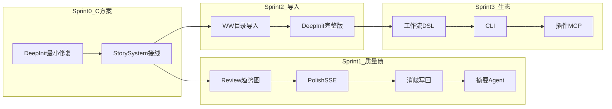

# NovelCraft Phase 4 执行简报编写计划


## 简报结构（将写入 PHASE4_EXECUTION_BRIEF.md）

### 元信息

```markdown
> **STATUS**: DONE
> **启动时间**：（签发日）
> **阶段**：Phase 4 — 生态与自动化 + Init 对齐 Webnovel Writer
> **PM 签发**：Cursor
> **执行者**：Claude Code（读本文档后自主执行，不要等待确认）
```

### §0 启动前必读

1. 本文档
2. `[docs/handoffs/PHASE3_HANDOFF.md](docs/handoffs/PHASE3_HANDOFF.md)` — 技术债与勿重复项
3. `[.cursor/plans/ai网文写作系统_94b0bbee.plan.md](.cursor/plans/ai网文写作系统_94b0bbee.plan.md)` — §5.3 初始化、§7 Phase 4、§8.6 验收
4. `[.claude-instructions.md](.claude-instructions.md)`
5. `[docs/TESTING.md](docs/TESTING.md)`
6. **参考样板**：`[cyDemo/第六面诊室/](cyDemo/第六面诊室/)` — WW 目录结构与 `.story-system/` 格式

---

### §1 本阶段目标

#### 1.0 Deep Init 最小修复（**最高优先级**）

解决 Phase 3 已知缺口：向导数据丢失、无自动总纲、无磁盘项目根。

- `premise_json` **持久化** — `projects` 表新增 `premise_json TEXT`（`[apps/api/app/models/project.py](apps/api/app/models/project.py)` + `[schema.py](apps/api/app/db/schema.py)` 迁移）；结构对齐 Architect premise：

```json
{
  "genre", "hook", "protagonist", "world_building", "power_system",
  "golden_finger", "constraints", "target_words", "target_chapters"
}
```

- **新建项目 API 扩展** — `POST /api/v1/projects` 或新端点 `POST /api/v1/projects/init` 接收完整 premise + title；写入 `premise_json`、设置 `root_dir`
- `root_dir` **绑定** — 创建时生成 `{NOVELCRAFT_DATA_ROOT}/{user_id}/{slug}/` 并落盘目录骨架：

```
{root_dir}/
├── 设定集/
├── 大纲/
├── 正文/
├── .novelcraft/
└── .story-system/
```

- **InitAgent / 设定集生成** — 新 Agent 或 Architect 扩展：基于 premise **AI 生成** `设定集/世界观.md`、`力量体系.md`、`主角卡.md`（禁止让用户手写全文）；参考 webnovel-init 的 `init_project.py` 产出规范
- **自动总纲** — 向导完成 → 自动调 `ArchitectAgent.synopsis(premise)` → 写 `synopsis_json` + `大纲/总纲.md`
- **MASTER_SETTING 初始化** — 调用 `[StorySystem.save_master_setting()](apps/api/app/story_system.py)`（当前从未调用，Phase 4 必须接线）
- **DeepInitWizard 改造** — `[DeepInitWizard.tsx](apps/web/src/pages/DeepInitWizard.tsx)` 提交完整 premise；成功后跳转规划中心且总纲已就绪
- **单测** — init API + wizard 提交 + 文件落盘 mock 测试

**验收标准（P4-INIT01）**：向导填完 → DB 有 `premise_json` + `synopsis_json` → 磁盘有设定集 3 文件 + `MASTER_SETTING.json` → 规划中心总纲 Tab 可直接展示

---

#### 1.1 Phase 3 遗留质量项（handoff §6 优先）


| 优先级 | 任务                                               | 关键文件                                                                                                |
| --- | ------------------------------------------------ | --------------------------------------------------------------------------------------------------- |
| P1  | ReviewPage 7 维趋势图                                | `[ReviewPage.tsx](apps/web/src/pages/ReviewPage.tsx)`，新增 Recharts                                   |
| P1  | PolishAgent SSE 流式 + 审查页「按 issue 修复」diff 预览 → 采纳 | `[polish.py](apps/api/app/agents/polish.py)`、ReviewPage                                             |
| P2  | 三级摘要卷/弧层 SummaryAgent + UI 编辑页                   | 新 Agent + `[summaries.py](apps/api/app/routers/summaries.py)` + 新前端页                                |
| P2  | 消歧采纳写回 Story System / Entity                     | `[disambiguation.py](apps/api/app/routers/disambiguation.py)`                                       |
| P2  | Architect 章纲 → `save_chapter_contract()` 接线      | `[agents.py](apps/api/app/routers/agents.py)`、`[story_system.py](apps/api/app/app/story_system.py)` |
| P1  | API 测试 DB 隔离（事务回滚 / 独立 test DB）                  | `[conftest.py](apps/api/tests/conftest.py)`                                                         |


---

#### 1.2 Deep Init 完整升级（对齐 webnovel-init）

在 1.0 最小修复基础上，向 Webnovel Writer 交互范式靠拢：

- **灵感来源 Step** — 原创 / 参考书拆书（可选）；拆书走 DeconstructAgent，只返回 JSON 不写 canon
- **结构化采集扩展** — 金手指、创意约束包（反套路 + 硬约束 ≥2）、反派分层、目标规模
- **分波次 AI 提问** — 后端 SSE 或分步 API：每轮只问缺失且阻塞下一步的字段（参考 `[webnovel-init/SKILL.md](file:///C:/Users/flat-mirror/.claude/plugins/cache/webnovel-writer-marketplace/webnovel-writer/6.0.0/skills/webnovel-init/SKILL.md)` Step 2–7）
- **创意约束包候选** — 2–3 套方案 + 五维评分，用户选一
- **充分性闸门对齐** — 与 webnovel-init 闸门字段一致（书名/题材/主角欲望缺陷/世界规模/力量体系/金手指/创意约束）
- `.novelcraft/idea_bank.json` — 写入选定创意约束，供后续 plan/write 引用

**验收标准（P4-INIT02）**：无参考书也可完成完整 init；有参考书时 DeconstructAgent 结果经用户确认后才进入生成

---

#### 1.3 Webnovel Writer 目录导入（cyDemo 式，首版）

- **ImportService** — 扫描本地目录，校验 `设定集/` + `大纲/` + `正文/` + `.story-system/` 存在（规则同 `[cyDemo/MiroFish-engine/bridge.py](cyDemo/MiroFish-engine/bridge.py)`）
- **导入 API** — `POST /api/v1/projects/import` body: `{ "source_path": "..." }` 或 `{ "root_dir": "..." }`（开发环境本地路径；生产可后续扩展 zip）
- **DB 映射** — 创建 Project + Chapters（从 `正文/第NNNN章-*.md`）+ Cards/Entities（从设定集 MD 解析或保留文件引用）
- **Story System 镜像** — 复制/链接 `.story-system/` 到项目 `root_dir`；`synopsis_json` 从 `大纲/总纲.md` 或 JSON 反推
- **路径映射** — `.webnovel/` → `.novelcraft/` 兼容层（summaries/checkpoints 路径对照）
- **导入 UI** — ProjectHub「导入现有项目」→ 路径输入 + 预览扫描结果 → 确认导入
- **回归样板** — 以 `[cyDemo/第六面诊室/](cyDemo/第六面诊室/)` 为 fixture，导入后规划中心/写作台可读写第 1 章

**验收标准（P4-F03）**：导入 cyDemo 样例 → 设定集/章纲/正文可读写 → Architect 可基于已有总纲续生成章纲

---

#### 1.4 生态与自动化（计划 §7 Phase 4 核心）

- **工作流 DSL v1** — YAML 触发器：`onChapterAccepted` / `onProjectCreate`；首条内置规则：accepted 后可选 PreChapterSim（可配置关）
- **插件加载** — `plugins/agents/` 目录扫描 + `agent.yaml` 注册；示例 Agent 1 个（如 combat_checker stub）
- **CLI** — `novelcraft write --project X --chapter N` 复用 API，与 Web 流水线结果一致
- **MCP 插件接口** — 文档 + 占位 endpoint/adapter（封面/扫榜等外部 skill 接入点）
- **多模型路由**（可选 MVP）— 项目级配置：写作/审查/推演可用不同 model

---

#### 1.5 可选（时间不足 SKIP，handoff 说明）

- Prompt 工坊 v1
- ReaderPulseSim
- Git 备份（章节 accepted 后 commit）
- zip 包上传导入

---

### §2 交付物清单


| #   | 模块              | 路径                                                  | 说明                         |
| --- | --------------- | --------------------------------------------------- | -------------------------- |
| 1   | Init 最小修复       | `DeepInitWizard.tsx` + projects router + InitAgent  | premise 落库 + 自动总纲          |
| 2   | 设定集生成           | `apps/api/app/agents/init.py`（新）                    | AI 生成世界观/力量/主角卡            |
| 3   | Story System 接线 | `story_system.py` + agents router                   | save_master/chapter/volume |
| 4   | WW 导入           | `apps/api/app/services/import_project.py` + router  | cyDemo 式目录                 |
| 5   | Deep Init 完整版   | wizard 多步 + DeconstructAgent                        | 对齐 webnovel-init           |
| 6   | Review 趋势       | `ReviewPage.tsx` + Recharts                         | 7 维 Radar/Line             |
| 7   | Polish SSE      | `polish.py` + ReviewPage                            | 流式 + issue 修复              |
| 8   | 摘要 Agent        | `agents/summary.py` + 摘要 UI 页                       | 卷/弧自动生成                    |
| 9   | 消歧写回            | `disambiguation.py`                                 | Story System 同步            |
| 10  | 工作流 DSL         | `apps/api/app/workflows/`                           | 触发器引擎                      |
| 11  | CLI             | `packages/cli/` 或 `apps/api/cli/`                   | novelcraft 命令              |
| 12  | 插件示例            | `plugins/agents/example/`                           | P4-F01 验收                  |
| 13  | 测试              | `apps/api/tests/` + `apps/web/src/pages/*.test.tsx` | 每功能单测                      |
| 14  | 共享类型            | `packages/shared-schemas/src/index.ts`              | premise/import/workflow 类型 |


---

### §3 技术约束

- 前端：shadcn/ui + Tailwind v4，禁止 Ant Design；Recharts 用于 metrics 趋势
- LLM：InitAgent / DeconstructAgent / SummaryAgent 走 `LLMProvider.for_user()`
- 文件层：`root_dir` 为权威磁盘根；DB 存索引与 JSON 镜像，导入时以 `.story-system/` 为准
- WW 兼容：`.story-system/` 格式对齐 Webnovel Writer 子集（见 cyDemo 样板）；`.webnovel/` 只读映射，不覆盖
- 拆书红线：DeconstructAgent 输出不得原样写入 canon；须用户确认 + 差异化变形（同 webnovel-init Step 1.5）
- 测试：`pnpm test` 全绿；新列走 `schema.py` 迁移
- UI：遵循 frontend-design / UI/UX Pro Max

---

### §4 不要重复做

摘自 `[PHASE3_HANDOFF.md](docs/handoffs/PHASE3_HANDOFF.md)` §7：

- LLM 设置页 + 用户 Key 管理
- Agent 基类 / Harness / Story System 读路径 / CHAPTER_COMMIT 投影链
- 写作台 SSE / 完整 Pipeline / Checkpoint 恢复
- 规划中心四 Tab MVP / 消歧队列 CRUD / 三级摘要 CRUD 基础
- 推演中心 / 图谱 / Cards-Entities-Foreshadowing CRUD
- BM25 搜索 + Phase 0–3 已有单测（扩展即可）

---

### §5 验收自检


| ID            | 验收项             | 标准                                                          |
| ------------- | --------------- | ----------------------------------------------------------- |
| **P4-INIT01** | Deep Init 最小修复  | 向导完成 → premise + synopsis 入库 → 设定集 3 文件 + MASTER_SETTING 落盘 |
| **P4-INIT02** | Deep Init 完整版   | 结构化采集 + 充分性闸门 + 可选拆书；idea_bank.json 写入                      |
| **P4-F03**    | WW 目录导入         | 导入 cyDemo/第六面诊室 → 设定/章纲/正文可读写                               |
| P4-F01        | 插件加载            | `plugins/agents/` 新 Agent 重启后 API 可调度                       |
| P4-F02        | 工作流触发           | onChapterAccepted → PreChapterSim（可配置关）                     |
| P4-F04        | CLI             | `novelcraft write --project X --chapter N` 与 Web 一致         |
| P4-REV01      | 7 维趋势图          | ReviewPage 展示 Radar/Line，数据来自 metrics API                   |
| P4-POL01      | Polish SSE      | 流式润色 + issue 修复 diff 采纳                                     |
| P4-SUM01      | 三级摘要            | 卷/弧 Agent 生成 + UI 编辑                                        |
| P4-DIS01      | 消歧写回            | accept 后 Story System / entity 更新                           |
| P4-SS01       | Story System 接线 | Architect 章纲 → chapter contract 文件                          |
| P4-T01        | 单测              | Phase 4 新功能均有单测；`pnpm test` 全绿                              |
| P4-NF01       | 文档              | 导入指南 + 插件开发 + OpenAPI 更新                                    |


> 完整 ID 见计划 §8.6

---

### §6 建议执行顺序




1. **Deep Init 最小修复**（1.0）— 用户最痛：数据丢失
2. *Story System save_ 接线** — init/architect/disambiguation 共用
3. **Phase 3 质量债** — Review 趋势 → Polish SSE → 消歧 → 摘要
4. **WW 目录导入** — 可立即导入 cyDemo 第六面诊室 继续写
5. **Deep Init 完整升级** — 对齐 webnovel-init 交互
6. **工作流 DSL + CLI + 插件**
7. **可选** + **交接**

---

### §7 环境说明

```bash
cd c:\Users\flat-mirror\Desktop\mirofish
pnpm install
pnpm dev:api    # :8000
pnpm dev:web    # :5173
pnpm test

# WW 导入测试用本地路径
# cyDemo/第六面诊室/
```

开发账号：`admin` / `admin123456`

---

### §8 完成后必须产出

- 本文档 **STATUS: DONE**
- `[docs/handoffs/PHASE4_HANDOFF.md](docs/handoffs/PHASE4_HANDOFF.md)`
- `[CLAUDE.md](CLAUDE.md)` → 当前阶段 Phase 5（或标记 Phase 4 完成）
- `[docs/PROGRESS.md](docs/PROGRESS.md)` + `[docs/CURRENT_TASK.md](docs/CURRENT_TASK.md)`
- `pnpm test` 全绿
- git commit 含 handoff

---

### §9 备注

- Phase 4 范围 = **C 方案 Init 对齐** + **计划 §7 生态项** + **Phase 3 handoff 技术债**
- Init 哲学转变：从「作者手写设定」→「AI 提问 + 生成设定集 + 自动总纲」；WW 导入作为已有项目的快捷入口
- zip 上传 / ReaderPulseSim / Prompt 工坊 / Git 备份标记 OPTIONAL
- 导入首版仅 cyDemo 式完整目录；zip 与 SaaS 路径输入留 Phase 4 后期或 Phase 5

---

## 实施动作（确认后执行）

1. **覆写** `[docs/briefs/PHASE4_EXECUTION_BRIEF.md](docs/briefs/PHASE4_EXECUTION_BRIEF.md)` 为上述完整内容（STATUS: PENDING，创建日期 2026-05-25）
2. **更新** `[docs/PROGRESS.md](docs/PROGRESS.md)` Phase 4 行：状态 →「简报已签发」
3. **更新** `[docs/CURRENT_TASK.md](docs/CURRENT_TASK.md)`（若存在）指向 Phase 4 简报
4. **不修改** `[CLAUDE.md](CLAUDE.md)` 阶段号（Phase 4 完成后再改）

**不在本次范围**：直接写 InitAgent / ImportService 代码（仅产出 PM 签发用的执行简报文档）