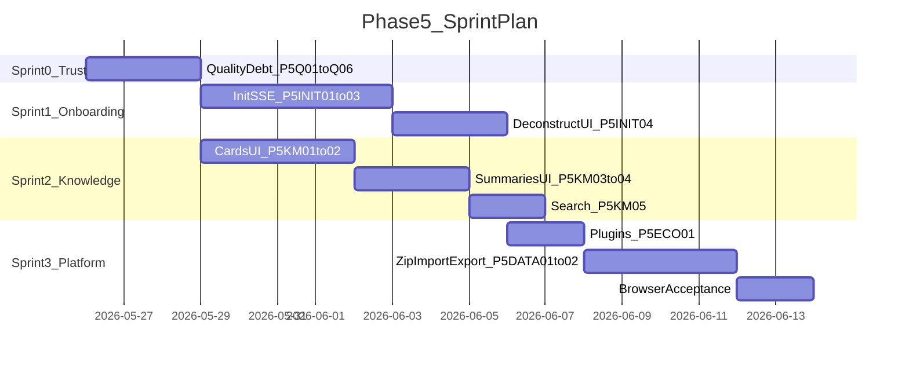

# NovelCraft Phase 5 执行简报

> **STATUS**: DONE
> **启动时间**：2026-05-26
> **完成时间**：2026-05-26
> **阶段**：Phase 5 — 作者闭环与知识工作台
> **PM 签发**：Cursor
> **执行者**：Claude Code（读本文档后自主执行，不要等待确认）

---

## §0 启动前必读

1. 本文档
2. `docs/handoffs/PHASE4_HANDOFF.md` — 技术债与勿重复项
3. `.cursor/plans/phase_5_产品规划_c22c03c8.plan.md` — 本阶段权威产品规划
4. `docs/acceptance/PHASE4_BROWSER_ACCEPTANCE_ISSUES.md` — Track 0 的 6 个 BUG
5. `.claude-instructions.md` — 全局强制规则
6. `docs/TESTING.md` — 测试规范

---

## §1 本阶段定位

### Phase 4 → Phase 5 的本质跃迁

| 维度 | Phase 4（已完成） | Phase 5（目标） |
|------|-------------------|-----------------|
| 产品形态 | 引擎 + 生态骨架 | **可交付的作者产品** |
| 核心矛盾 | 后端能力 > 前端暴露 | **能力接线 + 体验闭环 + 信任修复** |
| 用户感知 | 功能很多但找不到/用不了 | 开书有 AI 引导，写书有知识库支撑 |

### North Star

**「新作者在 30 分钟内完成开书并产出第 1 章可审查草稿」**（TTFCh — Time To First Chapter）

---

### Track 0：信任修复（Sprint 0，Gate——必须先做）

来源：`docs/acceptance/PHASE4_BROWSER_ACCEPTANCE_ISSUES.md`

| ID | 任务 | 关键文件 | 验收标准 |
|----|------|----------|----------|
| **P5-Q01** | 插件路径修复 | `apps/api/app/routers/plugins.py`、`config.py` | `GET /api/v1/plugins` 返回 `combat_checker` |
| **P5-Q02** | Polish SSE 协议对齐 | `ReviewPage.tsx`、`routers/agents.py` | 一键修复可见 diff / issue_error，不再静默 |
| **P5-Q03** | LLM 失败降级 UX | `init.py`、`DeepInitWizard.tsx` | 无 LLM 时生成 stub 设定 + 总纲；前端 toast 明确告警 |
| **P5-Q04** | `_slugify` 中文路径 | `apps/api/app/routers/projects.py` | 中文书名目录可创建；纯英文不 fallback 为 `untitled` |
| **P5-Q05** | CLI Windows 编码 | `packages/cli/novelcraft.py` | `novelcraft list` GBK 控制台不崩溃 |
| **P5-Q06** | API 测试 DB 隔离 | `apps/api/tests/conftest.py` | 并行/重复跑 pytest 无 SQLite lock flaky |

**Gate**：Track 0 全部 PASS 后才进入 Track 1/2 新功能开发。

---

### Track 1：智能开书（差异化核心，P1）

| ID | 任务 | 说明 | 验收标准 |
|----|------|------|----------|
| **P5-INIT01** | 对话式 Init SSE | 后端 `POST /projects/init/chat` SSE 端点，每轮只问缺失且阻塞字段 | 用户可纯对话完成充分性闸门（书名/题材/主角/世界/力量/金手指/约束） |
| **P5-INIT02** | 创意约束包 | 2-3 套方案 + 五维评分，用户选一写入 `idea_bank.json` | 规划中心可读选定约束 |
| **P5-INIT03** | Hub 入口与模式选择 | ProjectHub 增加「深度初始化」入口；Step 0 选「原创 / 参考书」 | 不再依赖手动输入 URL |
| **P5-INIT04** | DeconstructAgent 全流程 UI | 参考书选择 → 拆解 SSE → 预览 JSON → 用户确认 → 差异化写入 premise（**不写 canon**） | 拆书结果经确认后才进入 InitAgent |
| **P5-INIT05** | Init 单测 + E2E | `test_init_chat.py` + `DeepInitWizard.test.tsx` 扩展 | mock LLM 覆盖 SSE 事件流 |

**产品原则**：
- 表单模式保留作「快速通道」，对话模式为默认推荐
- 拆书红线与 Phase 4 一致：DeconstructAgent 输出不得原样进 canon

---

### Track 2：知识工作台（高 ROI 接线，P1）

Phase 1-3 已建 Cards/Entities/BM25/Summaries API，**前端完全缺失**——这是 Phase 5 最高性价比工作。

| ID | 任务 | 说明 | 验收标准 |
|----|------|------|----------|
| **P5-KM01** | 设定卡片管理页 | 新页 `/projects/:id/cards`：角色/势力/规则/道具 CRUD | 与 `routers/cards.py` 全 CRUD 对齐；ProjectNav 新增 Tab |
| **P5-KM02** | 实体关系编辑 | Cards 页内嵌 entity/relationship 编辑 | 图谱 GraphView 可展示手动创建的节点 |
| **P5-KM03** | 三级摘要页 | 新页 `/projects/:id/summaries`：章/弧/卷 Tab + 编辑 | 调用 `routers/summaries.py` CRUD |
| **P5-KM04** | 摘要 AI 生成 | 前端接 `POST /summaries/{project_id}/generate` | 卷/弧层一键生成 + 进度反馈 |
| **P5-KM05** | 项目内搜索 Cmd+K | 全局/项目级 Command Palette | 接 `GET /agents/search/{project_id}` BM25 |
| **P5-KM06** | 项目编辑/归档 | ProjectHub 卡片菜单：编辑书名/简介/归档 | 使用已有 `updateProject` API |

**用户价值**：日更作者可在写作中快速查设定、维护实体图谱、浏览卷级摘要——解决 Phase 2 图谱「永远空态」的根因。

---

### Track 3：平台与迁移（P2）

| ID | 任务 | 说明 | 验收标准 |
|----|------|------|----------|
| **P5-ECO01** | 插件管理面板 | 新页 `/settings/plugins`：list/load/toggle/reload 可视化 | 插件 toggle 生效 |
| **P5-ECO02** | 工作流只读视图 | 展示当前 YAML 规则 + 触发历史 | 不要求复杂编辑器（Phase 6） |
| **P5-DATA01** | zip 上传导入 | `POST /projects/import/upload` multipart | 浏览器可上传 zip，等价于本地路径导入 |
| **P5-DATA02** | 项目导出包 | `GET /projects/{id}/export` 返回 zip | 含设定集/大纲/正文/.story-system |
| **P5-DATA03** | Simulations API 统一 | `SimulationCenter.tsx` 迁入 `api.ts` | 消除内联 fetch，类型一致 |

---

### Track 4：体验抛光（P3，时间允许）

| ID | 任务 | 说明 |
|----|------|------|
| P5-UX01 | Recharts 浅色主题色差 | ReviewPage 图表 token 对齐 |
| P5-UX02 | 1280px 响应式复验 | Phase 2 PARTIAL 项补截图验收 |
| P5-UX03 | 无 Key 引导条 | LLM 未配置时全局 Banner（Phase 2 SKIP 项） |

---

### Out of Scope → Phase 6

以下连续 defer，**不纳入 Phase 5 Must-Have**：

- Prompt 工坊 v1（项目级 prompt 编辑）
- ReaderPulseSim（弃书风险评分）
- Git 备份（章节 accepted 自动 commit）
- 工作流 DSL 复杂条件/循环 + 可视编辑器
- CLI 批量操作 / 项目筛选
- 多模型路由 UI
- pgvector RAG / SaaS 多租户

---

## §2 交付物清单

### Must-Have（14 项）

| # | 模块 | 路径 | 说明 |
|---|------|------|------|
| 1 | P5-Q01 ~ Q06 | `plugins.py`/`agents.py`/`init.py`/`projects.py`/`cli`/`conftest.py` | 质量还债 |
| 2 | 对话式 Init SSE | `apps/api/app/routers/init_chat.py`（新）+ `DeepInitWizard.tsx` | P5-INIT01~03 |
| 3 | 创意约束包 | `apps/api/app/agents/init.py`（扩展） | P5-INIT02 |
| 4 | DeconstructAgent UI | `apps/web/src/pages/DeconstructPage.tsx`（新）+ `deconstruct.py`（扩展） | P5-INIT04 |
| 5 | 设定卡片管理页 | `apps/web/src/pages/CardsPage.tsx`（新） | P5-KM01~02 |
| 6 | 三级摘要页 | `apps/web/src/pages/SummariesPage.tsx`（新） | P5-KM03~04 |
| 7 | Cmd+K 搜索 | `apps/web/src/components/CmdKSearch.tsx`（新） | P5-KM05 |
| 8 | 项目编辑/归档 UI | `ProjectHub.tsx`（扩展） | P5-KM06 |
| 9 | 插件管理面板 | `apps/web/src/pages/PluginManager.tsx`（新） | P5-ECO01 |
| 10 | zip 上传导入 | `projects.py`（扩展）+ `ProjectHub.tsx`（扩展） | P5-DATA01 |
| 11 | 项目导出包 | `apps/api/app/services/export_project.py`（新）+ `projects.py` | P5-DATA02 |
| 12 | 单测 | `test_init_chat.py` + 各新页测试文件 | P5-INIT05 + 全覆盖 |

### Should-Have（4 项）

| # | 模块 | 说明 |
|---|------|------|
| 13 | 工作流只读视图 | P5-ECO02 |
| 14 | Simulations API 统一 | P5-DATA03 |
| 15 | 体验抛光 3 项 | P5-UX01 ~ UX03 |

### 文档产出

- `docs/handoffs/PHASE5_HANDOFF.md`
- `docs/acceptance/PHASE5_BROWSER_ACCEPTANCE_ISSUES.md`
- 更新 `PROGRESS.md` / `CURRENT_TASK.md` / `CLAUDE.md`

---

## §3 技术约束

- **前端**：shadcn/ui + Tailwind v4；`cmdk` 或自定义 Command Palette 用于 Cmd+K 搜索
- **LLM**：InitAgent 扩展走 `LLMProvider.for_user()`；无 LLM 时必须走 stub 降级路径
- **SSE 协议**：统一使用 `event: {type}\ndata: {json}` 格式（修复 Phase 4 不一致问题）
- **文件层**：`root_dir` 为权威磁盘根；zip 导出复用 ImportService 路径校验
- **zip 安全**：导入时服务端 sandbox 解压 + 结构校验 + 路径遍历防护
- **DeconstructAgent 红线**：输出不得原样写入 canon，须用户确认 + 差异化变形
- **测试**：`pnpm test` 全绿；新功能每项有单测；Track 0 修复带回归测试
- **UI**：遵循 frontend-design / UI/UX Pro Max

---

## §4 不要重复做

摘自 `PHASE4_HANDOFF.md` §7：

- 所有 Agent 基类与 LLM 调用链
- Story System 文件层 CRUD（MASTER_SETTING / chapter_contract / volume_contract）
- 写作台 SSE / 流水线 / Checkpoint 恢复
- 规划中心四 Tab / 消歧队列 / 审查中心
- 插件加载基础设施 / 工作流引擎
- BM25 搜索 / 图谱数据 API
- Phase 0-4 已有单测

---

## §5 验收自检

| ID | 验收项 | 类型 |
|----|--------|------|
| **P5-G01** | Track 0 六项质量债全部 PASS | 回归 |
| **P5-G02** | 对话式 Init 无参考书路径 E2E 通过 | 核心流程 |
| **P5-G03** | 参考书拆解 → 确认 → 开书 E2E 通过 | 核心流程 |
| **P5-G04** | Cards CRUD + 图谱可见手动实体 | 知识工作台 |
| **P5-G05** | 三级摘要 UI + AI 生成卷/弧 | 知识工作台 |
| **P5-G06** | Cmd+K 搜索返回实体/卡片 | 知识工作台 |
| **P5-G07** | zip 导入/导出 round-trip | 迁移 |
| **P5-G08** | 插件面板 toggle 生效 | 生态 |
| **P5-G09** | `pnpm test` 全绿 + `pnpm test:coverage` 达标 | 工程 |
| **P5-G10** | `PHASE5_BROWSER_ACCEPTANCE_ISSUES.md` 编写并完成浏览器验收 | 产品 |

---

## §6 建议执行顺序



**并行策略**：Sprint 0 完成后，Track 1（Init）与 Track 2（Cards/摘要）可并行执行；Track 3 依赖 Track 0 的插件路径修复。

**信息架构变更（Phase 5 完成后）**：

```
ProjectNav 扩展：
  章节 | 规划中心 | 设定卡片(新) | 摘要(新) | 推演 | 图谱 | 消歧

ProjectHub 扩展：
  [快速新建] [深度初始化(新)] [导入项目] [导入 zip(新)]

全局：
  Cmd+K 搜索(新)
  Settings → 插件管理(新)
```

---

## §7 环境说明

```bash
cd c:\Users\flat-mirror\Desktop\mirofish
pnpm install
pnpm seed
pnpm dev:api    # :8000
pnpm dev:web    # :5173
pnpm test

# 导出测试用
# cyDemo/第六面诊室/ 为 WW 导入参考样板
```

开发账号：`admin` / `admin123456`

---

## §8 完成后必须产出

- 本文档 **STATUS: DONE**
- `docs/handoffs/PHASE5_HANDOFF.md`
- `docs/acceptance/PHASE5_BROWSER_ACCEPTANCE_ISSUES.md`
- `CLAUDE.md` → 当前阶段 Phase 6（或标记 Phase 5 完成）
- `docs/PROGRESS.md` + `docs/CURRENT_TASK.md`
- `pnpm test` 全绿
- git commit 含 handoff

---

## §9 风险与缓解

| 风险 | 缓解 |
|------|------|
| Init SSE 复杂度高，挤压 Track 2 | Sprint 1 仅交付 INIT01-03；INIT04 可降为 Should-Have |
| Cards UI 范围膨胀 | MVP 仅 4 类卡片 CRUD，关系编辑做 inline 不做独立画布 |
| zip 导入安全（路径遍历） | 服务端 sandbox 解压 + 结构校验复用 ImportService |
| LLM 成本（对话 Init 多轮） | 充分性闸门 + 字段缓存，避免重复提问 |

---

## §10 与 Phase 4 Handoff 的映射

| Phase 4 §7 建议 | Phase 5 对应 | 理由 |
|-----------------|-------------|------|
| API 测试稳定性 | P5-Q06 | 降为 Sprint 0 而非独立主题 |
| Deep Init SSE + Deconstruct UI | Track 1 P1 | 产品差异化，保留最高优先级 |
| 插件/工作流 UI | P5-ECO01/02 | 面板优先，编辑器降级到 Phase 6 |
| zip 导入导出 | P5-DATA01/02 | 与 Cards/摘要并行，服务迁移用户 |
| Prompt/ReaderPulse/Git | Phase 6 | 连续 defer 三次，避免 scope creep |

**新增（Phase 4 未显式列出但产品必需）**：
- Cards/摘要/搜索 UI 接线 — 后端能力闲置是最大产品债务
- Phase 4 浏览器验收 P1 修复 — 信任基线
