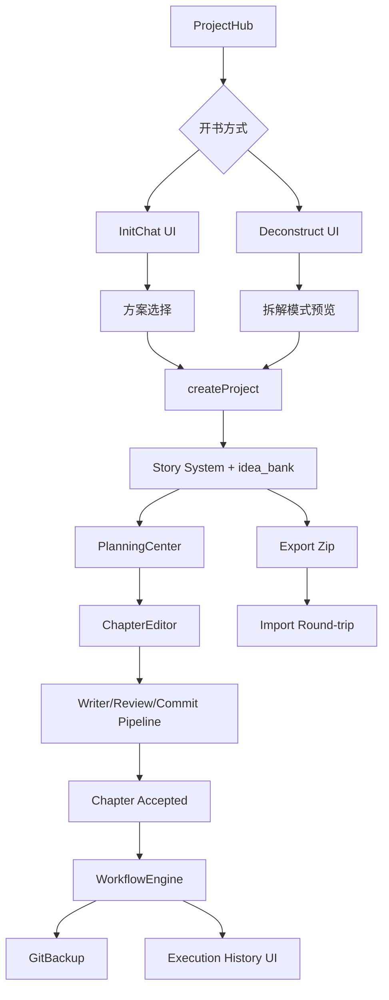
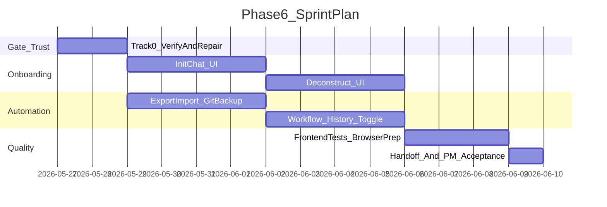

# NovelCraft Phase 6 执行简报

> **STATUS**: PENDING
> **阶段**：Phase 6 — 开书到章节交付闭环
> **创建日期**：2026-05-27
> **PM 签发**：Cursor
> **执行者**：Claude Code（读本文档后自主执行，不要等待确认）

---

## 0. 启动前必读（按顺序）

1. 本文档（Phase 6 执行简报）
2. `docs/handoffs/PHASE5_HANDOFF.md` — 上一阶段交接，只读这一份 handoff
3. `.cursor/plans/产品后续规划_c42d14d8.plan.md` — Phase 6 路线与验收标准
4. `.claude-instructions.md` — 单元测试、交接文档、PM 派单流程
5. `docs/TESTING.md` — 每个功能必须有单元测试
6. `docs/handoffs/HANDOFF_TEMPLATE.md` — 完成 Phase 6 时必须按模板生成交接文档

---

## 1. 本阶段定位

Phase 6 的目标不是继续扩张 Agent 数量，而是把 Phase 5 已有但尚未产品化的能力串成单个作者每天能用的闭环。

**North Star**：作者从一个想法进入系统，到完成开书设定、写出可审查章节、采纳并自动备份，关键路径不超过 3 次主操作；导出后重新导入不丢正文、设定、章纲、摘要和 Story System。

### 本阶段必须坚持的产品原则

- **入口任务化**：InitChat、Deconstruct 不能做成隐藏设置页，应从 ProjectHub / DeepInitWizard 进入，围绕“开一本书”完成。
- **能力复用优先**：优先接 Phase 5 已有后端端点、Story System、WorkflowEngine、ImportService，不重写 Agent 基座和写作流水线。
- **自动化可解释**：Workflow / GitBackup 的结果必须在 UI 可见，失败时能告诉作者失败原因，而不是后台静默。
- **可信迁移**：导入导出不是下载按钮，而是数据可靠性承诺；必须用 round-trip 测试证明。

---

## 2. 架构师实现指导（Claude Code 必读）

### 2.1 总体架构建议

把 Phase 6 当作“接线与闭环”工程，而不是新平台工程。理想数据流如下：



关键判断：UI 可以新增，但领域逻辑尽量落在现有 API / service 层。不要把 SSE 解析、premise 拼装、导入导出规则散落在多个页面里；前端只维护交互状态和明确的 API 调用。

### 2.2 InitChat 如何更好完成

目标不是“做一个聊天框”，而是“把聊天结果稳定转成可创建项目的 premise”。

建议做法：

- 新增 `InitChatPage` 或在 `DeepInitWizard` 内增加「对话开书」模式，ProjectHub 入口默认推荐对话模式，保留现有表单模式作为快速通道。
- 前端维护 `history`、结构化采集状态、当前缺失字段、SSE loading / error / retry；每轮只把用户输入和历史传给 `POST /projects/init/chat/stream`。
- 对 `status=asking / complete / confirmed / error` 做显式状态机，避免靠字符串判断页面流程。
- `complete` 后展示 2-3 套创意约束方案，方案卡片必须显示五维评分、题材侧重、卖点变体、力量演进和目标规模。
- 用户选择方案后，用现有 `createProject` 创建项目；写入 `constraints`、`golden_finger`、`target_words`、`target_chapters`，确保后端继续生成设定集、总纲、`.story-system` 和 `idea_bank.json`。
- 无 LLM 时仍可通过 fallback 问题与方案完成流程，UI 要显示“已使用本地降级方案”的温和提示。

验收重点：用户不需要理解后端 Agent，也不需要复制 JSON；整个开书路径应该像一个有记忆的编辑助手。

### 2.3 Deconstruct 如何更好完成

目标不是“展示拆书 JSON”，而是“从参考书提取可迁移模式，并安全转化为原创项目输入”。

建议做法：

- 新增 `DeconstructPage` 或 DeepInit 的「参考书拆解」模式，支持粘贴 1-3 段样章文本；本地路径输入可以保留为开发态高级选项，不作为主路径。
- 接 `POST /projects/init/deconstruct/stream`，展示 `analyzing / done / error` 阶段，拆解完成后分区展示黄金三章、爽点、人设、世界观、叙事节奏、可迁移模式、红线警告。
- 必须有“差异化改写 / 确认写入”步骤。不要把原书角色、地名、具体情节直接写入 canon。
- 确认后生成原创 premise 草稿，进入 `createProject` 或 InitChat 方案选择；可迁移模式进入 `constraints` / `idea_bank`，而不是直接污染 `MASTER_SETTING`。
- 如果后端缺少“确认写入”端点，优先复用 `createProject` 的 premise 输入，不要为了本阶段发明复杂新数据模型。

验收重点：参考书只提供模式，不成为项目事实；UI 要让作者看到哪些内容可用、哪些内容禁止复制。

### 2.4 Workflow / GitBackup 如何更好完成

目标不是做复杂可视化工作流，而是让 `onChapterAccepted` 真正可用、可观测、可关闭。

建议做法：

- 先核验现有 `app.workflows.get_workflow_engine()` 是否已是全局 singleton，并已注册 `sim`、`notify`、`git_backup` handler；若已通过测试，不要重写。
- `PipelineRunner` 已在 accepted 后触发 `WorkflowTrigger.ON_CHAPTER_ACCEPTED`，应补齐执行历史记录与 UI 可见状态，而不是重复加触发点。
- GitBackup 应具备 enable/disable、最近一次结果、失败原因。项目目录不是 git repo 时应返回可理解状态，例如 `skipped: not_git_repo`，而不是抛 500。
- 工作流编辑 MVP 只做启停 + YAML/JSON 只读或轻编辑 + 执行历史；复杂拖拽画布、条件分支编辑器留 Phase 8。
- 如果写入执行历史，优先新增小而清晰的数据模型或文件日志：`workflow_runs` / `.novelcraft/workflow_runs.jsonl` 二选一，不要同时维护两套权威状态。

验收重点：章节 accepted 后，作者能在工作流页看到触发过什么、成败如何、下一步怎么处理。

### 2.5 Export / Import 如何更好完成

目标是可恢复，不是只打包。

建议做法：

- 导出 zip 必须包含 `设定集/`、`大纲/`、`正文/`、`.story-system/`，且不应包含 `.novelcraft/` 中的运行时私有状态，除非文档明确说明。
- 中文书名下载头必须保持 RFC 5987 兼容，避免 Windows / 浏览器 latin-1 崩溃。
- round-trip 测试必须证明：导出 → 上传导入 → 项目可打开 → 正文、设定、章纲、Story System、摘要可恢复。
- 对“无法从 UI 直接验收”的文件完整性，用 API 测试和 zip 内容断言验收，并在 handoff 中说明。

验收重点：迁移后作者能继续写，而不是只看到项目列表里多了一项。

---

## 3. Track 拆解

### Track 0：信任修复与现状核验（Gate，必须先完成）

| ID | 任务 | 关键范围 | 验收标准 |
|----|------|----------|----------|
| P6-Q01 | 中文标题 zip 导出稳定性 | `projects.py` export | 中文书名导出 200，`Content-Disposition` 使用 `filename*` |
| P6-Q02 | 导出包含 Story System | export / import service | zip 含 `.story-system/MASTER_SETTING.json`，不含不该迁移的运行时私有状态 |
| P6-Q03 | Workflow handler 注册 | `app/workflows/__init__.py` | `sim` / `notify` / `git_backup` handler 已注册，触发不返回无 handler skipped |
| P6-Q04 | Workflow singleton 一致性 | pipeline / plugins router / workflow engine | 页面启停与 pipeline 触发使用同一个 engine 状态 |
| P6-Q05 | SSE 鉴权与错误语义核验 | init/deconstruct SSE + web api | 401、业务错误、LLM fallback 在前端均可理解 |

**Gate**：Track 0 测试全部 PASS 后，才能进入 Track 1/2。若仓库里已有实现和测试，先运行并确认，不要重复改写。

### Track 1：InitChat 前端产品化（P1）

| ID | 任务 | 说明 | 验收标准 |
|----|------|------|----------|
| P6-INIT01 | ProjectHub / DeepInit 入口 | 新增「对话开书」入口，保留表单快速通道 | 作者可从 Hub 进入对话开书 |
| P6-INIT02 | SSE 对话组件 | 接 `POST /projects/init/chat/stream`，维护 history 与状态机 | `asking / complete / error` 均有 UI |
| P6-INIT03 | 创意方案选择 | 展示 2-3 个方案与五维评分 | 用户选定方案后可创建项目 |
| P6-INIT04 | 创建后写入既有闭环 | 复用 `createProject`，生成设定集、总纲、Story System、idea_bank | 创建成功后进入规划中心 |
| P6-INIT05 | 降级体验 | 无 LLM 时 fallback 仍可完成 | UI 明确提示使用降级方案 |

### Track 2：Deconstruct 前端产品化（P1）

| ID | 任务 | 说明 | 验收标准 |
|----|------|------|----------|
| P6-DEC01 | 参考书输入 UI | 粘贴样章为主，路径输入为高级选项 | 可提交 1-3 段样章 |
| P6-DEC02 | SSE 拆解进度 | 接 `POST /projects/init/deconstruct/stream` | 可见 analyzing / done / error |
| P6-DEC03 | 结构化预览 | 分区展示拆解结果和 warnings | 用户能看懂哪些可迁移、哪些禁止复制 |
| P6-DEC04 | 确认写入原创 premise | 将模式转成 constraints / hook / world hints | 不写入原作 canon，不复制角色地名情节 |
| P6-DEC05 | 与开书流程衔接 | 可继续生成项目或进入 InitChat 补充 | 有参考书路径 E2E 通过 |

### Track 3：备份与迁移可靠性（P1）

| ID | 任务 | 说明 | 验收标准 |
|----|------|------|----------|
| P6-DATA01 | Export / Import round-trip 加固 | 补齐正文、设定、章纲、摘要、Story System 断言 | API 测试证明迁移不丢核心数据 |
| P6-DATA02 | GitBackup handler 加固 | not git repo / no changes / commit success 均有状态 | 不因备份失败影响章节 accepted |
| P6-DATA03 | 备份状态 UI | 项目或工作流页展示最近备份结果 | 作者能看到最近一次备份成败 |
| P6-DATA04 | 备份开关 | 项目级或工作流级 enable/disable | 关闭后 accepted 不执行备份 |

### Track 4：Workflow 最小可用闭环（P1）

| ID | 任务 | 说明 | 验收标准 |
|----|------|------|----------|
| P6-WF01 | 工作流规则启停 UI | 接 `/plugins/workflows/{rule_name}/toggle` | UI toggle 后状态持久于 shared engine |
| P6-WF02 | 执行历史 | 记录 onChapterAccepted 触发结果 | WorkflowView 可见最近执行历史 |
| P6-WF03 | YAML/JSON 规则预览增强 | 保留只读或轻编辑，不做画布 | 用户能理解触发器、条件、动作 |
| P6-WF04 | accepted 触发验收 | pipeline accepted 后触发 workflow | sim / git_backup 至少一个动作结果可见 |

### Track 5：前端测试与体验补齐（P1）

| ID | 任务 | 说明 | 验收标准 |
|----|------|------|----------|
| P6-TEST01 | InitChat UI 测试 | mock fetch/SSE，覆盖 asking、complete、error | Vitest 通过 |
| P6-TEST02 | Deconstruct UI 测试 | mock SSE，覆盖预览和确认写入 | Vitest 通过 |
| P6-TEST03 | PluginManager / WorkflowView 测试 | 补 Phase 5 未覆盖项 | Vitest 通过 |
| P6-TEST04 | 导出/备份关键交互测试 | mock 下载、toggle、状态展示 | Vitest 通过 |
| P6-UX01 | 1280px 响应式复验 | InitChat / Deconstruct / Workflow | 无明显遮挡和不可操作 |

---

## 4. 交付物清单

| # | 模块 | 路径/范围 | 说明 |
|---|------|-----------|------|
| 1 | Phase 6 信任修复测试 | `apps/api/tests/test_track0_trust.py` 等 | 核验导出、Story System、Workflow singleton / handlers |
| 2 | InitChat UI | `apps/web/src/pages/InitChatPage.tsx` 或 `DeepInitWizard.tsx` 扩展 | 对话开书、方案选择、创建项目 |
| 3 | InitChat API client | `apps/web/src/lib/api.ts` | SSE helper / typed response |
| 4 | Deconstruct UI | `apps/web/src/pages/DeconstructPage.tsx` 或 DeepInit 模式 | 拆书输入、进度、预览、确认 |
| 5 | Workflow 状态 API | `apps/api/app/routers/plugins.py` / workflow service | 启停、执行历史、状态读取 |
| 6 | Workflow 执行历史 | DB model 或 `.novelcraft/workflow_runs.jsonl` | 只选一种权威存储 |
| 7 | GitBackup 加固 | `apps/api/app/workflows/__init__.py` 或独立 service | 状态可解释，不阻塞 accepted |
| 8 | Export / Import 加固 | `apps/api/app/routers/projects.py` / `services/import_project.py` | round-trip 完整性 |
| 9 | 前端测试 | `apps/web/src/**/*.test.tsx` | 新 UI 与 Phase 5 未覆盖页面 |
| 10 | 文档 | `docs/handoffs/PHASE6_HANDOFF.md` | 完成后按模板生成 |

---

## 5. 技术约束

- 前端：React 18 + TypeScript + shadcn/ui + Tailwind v4，禁止 Ant Design。
- 数据请求：优先集中到 `apps/web/src/lib/api.ts`；SSE 解析可抽小 helper，避免每页复制。
- 后端：优先复用现有 router / service / WorkflowEngine，不新增并行引擎。
- LLM：测试必须 mock，禁止真实 API Key 调用。
- SSE：前端要能处理 `data: {...}` 简单流；若后端后续改为命名事件，必须兼容并有测试。
- 文件系统：`root_dir` 是项目文件权威根；导入导出必须防路径遍历。
- GitBackup：只能作用于项目目录，不能对仓库根或用户任意路径执行 git；失败返回状态，不影响写作 pipeline 主流程。
- 测试：每个功能必须有单元测试；Phase 完成前 `pnpm test` 全绿，建议补跑 `pnpm test:coverage`。
- Git：每完成一个大步骤提交一次，commit message 用中文简述 why；最后一个 commit 必须包含 handoff。

---

## 6. 不要重复做

以下内容 Phase 0-5 已完成或已有骨架，Phase 6 不得重造：

- Agent 基座、`LLMProvider.for_user()`、写作流水线、Checkpoint 恢复。
- Story System 文件层 CRUD（`MASTER_SETTING` / chapter contract / volume contract）。
- InitChatAgent、DeconstructAgent 后端基础能力和 SSE 端点。
- Cards / Entities / Relationships / Summaries / Graph / BM25 搜索基础能力。
- PluginLoader 和 WorkflowEngine 骨架。
- ProjectHub 基础 CRUD、zip 上传导入、项目导出 zip 基础端点。
- ReviewPage、Polish SSE、PlanningCenter 四 Tab、SimulationCenter 基础能力。

如发现已有 Phase 6 局部实现，先读测试与现状，补齐缺口，不要用大规模重写替代核验。

---

## 7. 验收自检

| ID | 验收项 | 标准 |
|----|--------|------|
| P6-G01 | Track 0 信任修复全部 PASS | 中文导出、`.story-system`、Workflow handlers、singleton、SSE 错误语义均通过测试 |
| P6-G02 | 无参考书开书 E2E | ProjectHub → InitChat → 方案选择 → 创建项目 → 规划中心，10 分钟内可完成 |
| P6-G03 | 有参考书拆书 E2E | 样章输入 → SSE 拆解 → 模式预览 → 差异化确认 → 创建原创项目 |
| P6-G04 | 章节 accepted 自动化 | accepted 后触发 Workflow，sim/git_backup 结果可见，失败不阻塞主流程 |
| P6-G05 | GitBackup 可控可见 | 可启停；最近状态、失败原因、no changes 状态 UI 可见 |
| P6-G06 | 导出导入可信恢复 | round-trip 保留正文、设定、章纲、摘要、Story System |
| P6-G07 | WorkflowView 最小可用 | 规则启停、规则预览、执行历史可用 |
| P6-G08 | 前端测试补齐 | InitChat、Deconstruct、PluginManager、WorkflowView、导出/备份交互有测试 |
| P6-G09 | `pnpm test` 全绿 | API + Web 全量测试通过 |
| P6-G10 | 交接文档完整 | `PHASE6_HANDOFF.md` 含验收结果、不可浏览器验收项说明、测试表 |

PM 浏览器验收时，无法直接从浏览器确认的文件完整性、zip 内容、git commit 状态，必须在 handoff 中列为“非浏览器验收项”，并给出对应自动化测试或命令证据。

---

## 8. 建议执行顺序



并行策略：Track 0 完成后，Track 1/2（开书入口）与 Track 3/4（自动化保障）可以并行，但最终必须在同一个用户闭环里验收。

---

## 9. Out of Scope

Phase 6 不做以下内容：

- SaaS 多租户、云同步、团队协作权限。
- 插件市场、安全沙箱、第三方插件评分。
- 复杂拖拽工作流画布、节点式编排器、复杂条件分支编辑器。
- pgvector RAG、正式 Alembic 迁移、可靠任务队列。
- 全局 Prompt 工坊平台化。若确需 prompt 编辑，只允许项目级 MVP，并且不得挤压 InitChat / Deconstruct / Workflow / Backup 主目标。
- ReaderPulseSim 完整质量看板。可作为 workflow action 预留，但正式读者反馈系统进入 Phase 7。

---

## 10. 完成后必须产出

- [ ] 本文档顶部 **STATUS: DONE**
- [ ] `docs/handoffs/PHASE6_HANDOFF.md`（按 `HANDOFF_TEMPLATE.md`，含测试验收表）
- [ ] `CLAUDE.md` 当前阶段更新为 Phase 7，并修正“当前 Phase 必读”提示
- [ ] `docs/PROGRESS.md` 更新 Phase 6 状态与 Claude 最新回报
- [ ] `docs/CURRENT_TASK.md` 更新为 Phase 6 完成 / 等待 PM 浏览器验收
- [ ] `pnpm test` 全绿，建议 `pnpm test:coverage` 达标
- [ ] 最后一个 commit 含 handoff 文档
- [ ] 完成后通知 PM（Cursor）进行浏览器端最终验收

---

## 11. Claude Code 启动命令（PM 执行）

```powershell
cd C:\Users\DH\Desktop\code\webnovel-writer-web
claude --dangerously-skip-permissions --permission-mode bypassPermissions --effort high -p "$(Get-Content docs/briefs/PHASE6_EXECUTION_BRIEF.md -Raw)" --output-format text
```

或使用 `.claude-run-prompt.txt` 引导读本文档。
# NovelCraft Phase 6 执行简报

> **STATUS**: IN_PROGRESS
> **启动时间**：2026-05-27
> **阶段**：Phase 6 — 作者强闭环补齐
> **PM 签发**：Cursor
> **执行者**：Claude Code（读本文档后自主执行，不要等待确认）

---

## §0 启动前必读

1. 本文档
2. `docs/handoffs/PHASE5_HANDOFF.md` — 技术债与勿重复项
3. `.claude-instructions.md` — 全局强制规则
4. `docs/TESTING.md` — 测试规范

**North Star**：新作者从 ProjectHub 进入，**10 分钟内**完成开书（InitChat 或拆书）并进入可写第一章状态。

---

## §1 本阶段定位

| 维度 | Phase 5（已完成） | Phase 6（目标） |
|------|-------------------|-----------------|
| 产品形态 | 能力已建，前端缺口大 | **开书→写作→备份→迁移** 全链路可感知 |
| 核心矛盾 | InitChat/Deconstruct 仅后端 | **前端产品化 + 自动化真正跑起来** |
| 用户感知 | 静态向导、工作流只读 | 对话开书、拆书预览、章节自动备份 |

---

### Track 0：信任修复（Gate — **已完成**，commit `ef750b2`）

| ID | 任务 | 状态 |
|----|------|------|
| P6-Q01 | 中文书名 zip 导出 Content-Disposition UTF-8 | DONE |
| P6-Q02 | 导出 zip 含 `.story-system` + DB 章节 | DONE |
| P6-Q03 | WorkflowEngine 注册 sim/notify/git_backup handler | DONE |
| P6-Q04 | 全局 WorkflowEngine 单例 | DONE |

**Gate**：Track 0 已 PASS，直接进入 Track 1。

---

### Track 1：InitChat 前端产品化（P1，Must-Have）

| ID | 任务 | 关键文件 | 验收标准 |
|----|------|----------|----------|
| **P6-INIT01** | `api.ts` SSE 封装 | `apps/web/src/lib/api.ts` | `initChatStream`、`initSchemes` 封装；复用 `test_sse_event.py` 协议 |
| **P6-INIT02** | 对话 UI 组件 | `apps/web/src/components/InitChatPanel.tsx`（新建） | 多轮 SSE 对话、消息气泡、loading/error 态 |
| **P6-INIT03** | 创意方案选择 | 同上 + `DeepInitWizard.tsx` 或新页 | 充分性闸门通过后展示 2-3 套方案 + 五维评分，用户选一 |
| **P6-INIT04** | Hub 入口接线 | `ProjectHub.tsx`、`App.tsx` | 「对话开书」为默认推荐入口；保留静态向导作快速通道 |
| **P6-INIT05** | 单测 | `InitChatPanel.test.tsx` | mock EventSource 覆盖消息流、方案选择、错误态 |

**产品原则**：
- 复用 `ChapterEditor.tsx` / `ReviewPage.tsx` 的 SSE 模式，不要发明新协议
- 后端 `POST /projects/init/chat/stream`、`/init/schemes` 已存在，**只接前端**

---

### Track 2：Deconstruct 拆书前端（P1，Must-Have）

| ID | 任务 | 关键文件 | 验收标准 |
|----|------|----------|----------|
| **P6-DEC01** | 参考书输入 | `DeconstructPanel.tsx`（新建） | 文本粘贴或文件上传（txt/md） |
| **P6-DEC02** | SSE 拆解预览 | `api.ts` + 组件 | 流式展示拆解 JSON；结构化预览（模式/节奏/爽点，**非 canon**） |
| **P6-DEC03** | 确认写入 | `ProjectHub.tsx` 或向导 Step | 用户确认后才写入 `idea_bank.json` / premise；红线：不写原作 canon |
| **P6-DEC04** | 单测 | `DeconstructPanel.test.tsx` | mock SSE + 确认/取消流程 |

---

### Track 3：备份与迁移（P1，Must-Have）

| ID | 任务 | 关键文件 | 验收标准 |
|----|------|----------|----------|
| **P6-BAK01** | Git 备份项目设置 | 项目设置或 `.novelcraft/state.json` | 启用/禁用「章节 accepted 自动 commit」 |
| **P6-BAK02** | 项目创建时 git init | `routers/projects.py` | 启用备份的项目在 `root_dir` 自动 `git init` |
| **P6-BAK03** | 备份状态 UI | 项目设置页或 Sidebar | 显示最近 backup 时间/状态（成功/无变更/失败） |
| **P6-BAK04** | 导出 round-trip 测试 | `test_export_roundtrip.py` | zip 导出 → 导入 → `.story-system`/正文/设定一致 |

> 后端 `git_backup` handler 已在 `workflows/__init__.py` 注册；本 Track 补配置与 UI。

---

### Track 4：工作流最小闭环（P2，Should-Have）

| ID | 任务 | 关键文件 | 验收标准 |
|----|------|----------|----------|
| **P6-WF01** | 执行历史 API | `routers/plugins.py` 或新端点 | `GET /plugins/workflows/history` 返回最近 N 次触发记录 |
| **P6-WF02** | WorkflowView 增强 | `WorkflowView.tsx` | 展示触发历史；规则 enable/disable（toggle 端点已有） |
| **P6-WF03** | YAML 基础编辑 | `WorkflowView.tsx` | textarea 编辑 + 保存 + 语法校验错误提示（不做拖拽画布） |
| **P6-WF04** | 单测 | `WorkflowView.test.tsx`、`PluginManager.test.tsx` | 列表渲染、toggle、历史展示 |

---

### Track 5：体验抛光（P3，时间允许）

| ID | 任务 | 说明 |
|----|------|------|
| P6-UX01 | Recharts 浅色主题 | ReviewPage 图表 token 对齐 |
| P6-UX02 | 1280px 响应式 | InitChat/Deconstruct 新页复验 |

---

### Out of Scope → Phase 7

- Prompt 工坊 v1
- ReaderPulseSim（弃书风险评分）
- 工作流拖拽画布 / 复杂条件循环 DSL
- 多模型路由 UI / pgvector RAG / SaaS 多租户
- CLI 批量操作

---

## §2 交付物清单

| # | 模块 | 路径/范围 | 说明 |
|---|------|-----------|------|
| 1 | InitChat 前端 | `InitChatPanel.tsx`、`api.ts`、路由 | SSE 对话开书 |
| 2 | Deconstruct 前端 | `DeconstructPanel.tsx` | 拆书预览 + 确认 |
| 3 | Git 备份 | 项目设置 + pipeline 接线 | 自动 commit + 状态 UI |
| 4 | 工作流 | `WorkflowView.tsx` 增强 | 历史 + YAML 编辑 |
| 5 | 测试 | 新组件单测 + round-trip | `pnpm test` 全绿 |

---

## §3 技术约束

- 前端：shadcn/ui + Tailwind v4，禁止 Ant Design
- API 代理：`vite.config.ts` → `http://localhost:8001`
- 每个功能 + bug 修复：**必须带单元测试**
- 每完成一个 Track：git commit（中文 message）+ `pnpm test` 全绿
- 遵循 frontend-design / UI/UX Pro Max

---

## §4 不要重复做

- Agent 基类 / LLMProvider / InitChatAgent / DeconstructAgent 后端
- Story System CRUD / 写作流水线 / Checkpoint
- 规划中心 / 消歧 / 三级摘要 / 审查中心 / Cards / BM25
- 插件扫描基础设施 / zip 导入路径遍历防护
- Track 0 信任修复（已完成）

---

## §5 验收自检

| ID | 验收项 | 标准 |
|----|--------|------|
| P6-G01 | Track 0 信任修复 | PASS（已完成） |
| P6-G02 | InitChat E2E | Hub → 对话开书 → 选方案 → 创建项目 → 可见设定集/总纲 |
| P6-G03 | Deconstruct E2E | 粘贴参考书 → SSE 预览 → 确认 → 进入 Init（不写 canon） |
| P6-G04 | Git 备份 | 章节 accepted → 项目目录有 git commit；UI 可见状态 |
| P6-G05 | 导出 round-trip | 导出 zip → 导入 → 正文/.story-system/设定恢复 |
| P6-G06 | 工作流历史 | WorkflowView 可见最近触发记录；toggle 生效 |
| P6-G07 | `pnpm test` 全绿 | 新功能均有单测 |

---

## §6 完成后必须产出

- [ ] 本文档顶部 **STATUS: DONE**
- [ ] `docs/handoffs/PHASE6_HANDOFF.md`
- [ ] `CLAUDE.md` 当前阶段更新为 Phase 7
- [ ] `docs/PROGRESS.md` 更新
- [ ] **通知 PM** 做浏览器端验收（`docs/acceptance/PHASE6_BROWSER_ACCEPTANCE_ISSUES.md`）
- [ ] 最后一个 commit 含 handoff 文档
- [ ] `pnpm test` 全绿

---

## §7 执行顺序

1. ~~Track 0（已完成）~~
2. **Track 1** InitChat 前端
3. **Track 2** Deconstruct 前端
4. **Track 3** Git 备份 + round-trip
5. **Track 4** 工作流最小闭环
6. **Track 5** 体验抛光（时间允许）

每完成一个 Track：git commit + `pnpm test`。
Phase 完成：handoff + **通知 PM 浏览器验收**。
