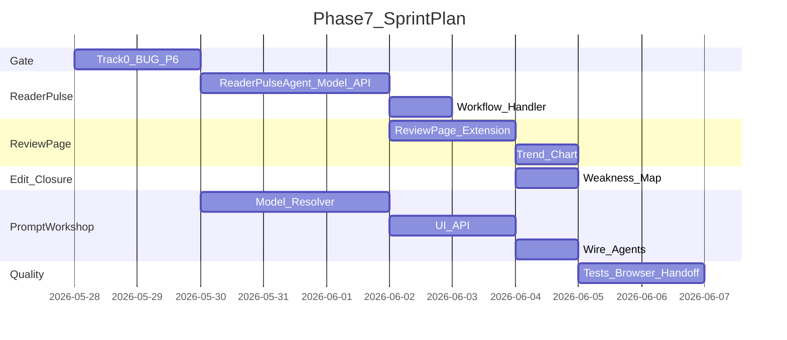

# NovelCraft Phase 7 执行简报

> **STATUS**: DONE
> **阶段**：Phase 7 — 读者视角质量系统
> **创建日期**：2026-05-28
> **PM 签发**：Cursor
> **执行者**：Claude Code（读本文档后自主执行，不要等待确认）

---

## 0. 启动前必读（按顺序）

1. 本文档（Phase 7 执行简报）
2. `docs/handoffs/PHASE6_HANDOFF.md` — 上一阶段交接，只读这一份 handoff
3. `.cursor/plans/产品后续规划_c42d14d8.plan.md` — Phase 7 路线与验收标准
4. `.claude-instructions.md` — 单元测试、交接文档、PM 派单流程
5. `docs/TESTING.md` — 每个功能必须有单元测试
6. `docs/handoffs/HANDOFF_TEMPLATE.md` — 完成 Phase 7 时必须按模板生成交接文档

---

## 1. 本阶段定位

Phase 7 的目标是让系统不仅能写和审，还能从**读者视角**判断章节是否值得读下去。

**North Star**：作者完成一章后，系统能模拟读者反应，给出弃书风险、爽点评价、期待点和下一章建议；这些反馈能直接转化为可执行的修订任务，再进入 Polish diff 预览。

### 本阶段必须坚持的产品原则

- **读者反馈不等于审查**：ReaderPulseSim 是「读者是否想看下去」，不是 ReviewAgent 的「设定是否一致」。两条链路独立，只在 ReviewPage 聚合展示。
- **闭环优于指标**：轻量读者反馈 + 一键改稿闭环，胜过复杂但无法行动的趋势图表。
- **Prompt 集中管理**：Phase 7 引入项目级 Prompt 工坊，所有 Agent prompt 通过统一 resolver 读取，不再在各 Agent 内复制查找逻辑。
- **先关 Gate 再扩张**：Phase 6 遗留浏览器验收缺口（BUG-P6-01/02、outline 导入）必须先关闭，才能进入 ReaderPulseSim 等新能力。

---

## 2. 架构师实现指导（Claude Code 必读）

### 2.1 总体架构建议

```mermaid
flowchart TB
  subgraph "已有能力（只复用，不重写）"
    review[ReviewAgent 7维审查]
    polish[PolishAgent 8轴润色]
    wf[WorkflowEngine]
    story[Story System]
  end

  subgraph "Phase 7 新增"
    rp[ReaderPulseSim Agent]
    rp_model[ReaderPulseResult 模型]
    rp_api[GET /projects/{id}/reader-pulse]
    review_page[ReviewPage 聚合看板]
    trend[最近10章趋势]
    prompt[Prompt 工坊 v1]
  end

  accepted[Chapter Accepted] --> wf
  wf --> rp_action[reader_pulse action]
  rp_action --> rp
  rp --> rp_model
  rp_model --> review_page
  review --> review_page
  polish --> review_page
  trend --> review_page
  rp --> revision[修订任务]
  revision --> polish
  prompt --> rp
  prompt --> review
  prompt --> polish
```

关键判断：
- ReaderPulseSim **不是** MiroFish SimulationJob 的替代，而是章节级读者反馈。
- ReviewPage 只做**聚合展示**，不替代 ReviewAgent/PolishAgent 的现有审查润色能力。
- Prompt 工坊只做**项目级**覆盖，不做全局 Prompt 市场、多模型路由、复杂版本历史。

### 2.2 ReaderPulseSim v1 如何落地

目标：章节 accepted 后，Agent 模拟读者反应，输出结构化 JSON 评估。

建议做法：

- 新增 `ReaderPulseAgent(BaseAgent)`，继承现有 BaseAgent 骨架。
- 输入：章节正文 + 前章摘要 + 项目设定（精简 context，不超过 4k tokens）。
- 输出 JSON Schema：
  ```json
  {
    "drop_risk": 0.0-1.0,
    "hook_quality": 1-10,
    "pacing_score": 1-10,
    "expectation": "string（读者期待什么）",
    "strengths": ["string"],
    "weaknesses": ["string"],
    "next_chapter_suggestion": "string",
    "overall_verdict": "string（30字内）"
  }
  ```
- 新增 `ReaderPulseResult` 数据模型，关联 chapter_id + project_id，append-only。
- Workflow 新增 `reader_pulse` action handler，在 `ON_CHAPTER_ACCEPTED` 时触发（默认禁用，可手动启用）。
- 测试：mock LLM 返回固定 JSON，验证 schema 解析与入库。

验收重点：读者反馈是**可操作**的，不是抽象评分。每个 weakness 应该能对应到 Polish 的一个 axis。

### 2.3 ReviewPage 聚合质量看板如何落地

目标：把 ReviewAgent、PolishAgent、ReaderPulseSim 的结果统一成「本章风险卡片 + 可修复建议」。

建议做法：

- 复用现有 `ReviewPage.tsx`，在其下方新增「读者反馈」Tab 或折叠面板。
- ReviewAgent issues → 保持现有阻塞/严重/轻微分级展示。
- ReaderPulseResult → 展示为「读者反应卡片」：弃书风险进度条 + 爽点/节奏评分 + 期待点 + 弱点列表。
- 新增「最近 10 章趋势」小图表：弃书风险走势 + 平均评分走势（复用 Recharts）。
- 从 ReaderPulse weakness 一键生成修订任务：点击 weakness → 预填 Polish 轴选择 → 进入 Polish SSE 预览。

验收重点：作者在一页内能看到「系统审了什么」+「读者会怎么看」+「怎么改」。

### 2.4 章级改稿闭环如何落地

目标：从 ReaderPulse 建议直接生成可执行修订。

建议做法：

- ReaderPulse weakness 映射到 Polish axis：
  - "节奏拖沓" → pacing
  - "对话平淡" → dialogue
  - "情绪不足" → emotion
  - "钩子弱" → hook
  - "描述过多" → description
  - "一致性断裂" → consistency
  - "AI味重" → ai_flavor
  - "逻辑不通" → coherence
- 点击 weakness 后，前端预填对应 axis，调用现有 `streamPolishUrl` SSE 链路。
- 不新建润色引擎，只在前端做「weakness → axis 映射 + 预填」。

验收重点：读者反馈到改稿不超过 2 次点击。

### 2.5 Prompt 工坊 v1 如何落地

目标：项目级 prompt 覆盖，统一 resolver，避免在各 Agent 内复制查找逻辑。

建议做法：

- 新增数据模型 `ProjectPrompt`（project_id / scope / key / content / is_default / created_at）。
- scope 枚举：`context` / `writer` / `review` / `reader_pulse`。
- 新增 API：
  - `GET /projects/{id}/prompts?scope=` — 列出项目级 prompt
  - `PUT /projects/{id}/prompts` — 更新/覆盖
  - `POST /projects/{id}/prompts/{key}/reset` — 恢复默认
- 新增 `PromptResolver` 类：统一读取逻辑——先查 `ProjectPrompt`，无覆盖则回退到 Agent 硬编码默认值。
- 前端新增「Prompt 工坊」页面（或 Settings 子 Tab）：按 scope 展示可编辑 prompt，支持恢复默认、测试运行（mock LLM 调用验证 prompt 不抛异常）。
- **不要**做：全局 Prompt 市场、版本历史、diff 对比、多模型路由。

验收重点：修改 prompt 后，同项目下次调用 Agent 生效；恢复默认后回到原始行为。

---

## 3. Track 拆解

### Track 0：Phase 6 遗留 Gate（必须先完成）

| ID | 任务 | 关键范围 | 验收标准 |
|----|------|----------|----------|
| P7-G01 | **BUG-P6-01** InitChat complete 可达性 | `InitChatPage.tsx` / `init_chat.py` | 多轮对话后稳定进入 `complete` 状态，展示方案选择 |
| P7-G02 | **BUG-P6-02** 前端导出 zip UI | `ProjectHub.tsx` 或项目详情页 | 浏览器可点击导出，下载 zip，Content-Disposition 正确 |
| P7-G03 | zip 导入恢复 DB outline | `import_project.py` | round-trip 后 DB `chapters.outline` 非空 |
| P7-G04 | 1280px 响应式复验 | `InitChatPage` / `DeconstructPage` | 1280px 无遮挡、无溢出、可操作 |
| P7-G05 | accepted → Workflow 浏览器全链路 | Pipeline + WorkflowView | 章节 accepted 后 WorkflowView 可见执行记录 |

**Gate**：Track 0 全部完成后，才能进入 Track 1-4。

### Track 1：ReaderPulseSim v1（P1）

| ID | 任务 | 说明 | 验收标准 |
|----|------|------|----------|
| P7-RP01 | ReaderPulseAgent | 继承 BaseAgent，输入章节+前章摘要+设定 | 输出符合 JSON Schema，含 drop_risk / hook_quality / pacing_score / expectation / strengths / weaknesses / next_chapter_suggestion / overall_verdict |
| P7-RP02 | ReaderPulseResult 模型 | `reader_pulse_results` 表 | 关联 chapter_id + project_id，支持查询最近 N 条 |
| P7-RP03 | reader_pulse API | `GET /projects/{id}/reader-pulse?chapter_id=` | 返回最近一次 reader pulse 结果 |
| P7-RP04 | Workflow action | `reader_pulse` handler 注册到 WorkflowEngine | ON_CHAPTER_ACCEPTED 可触发，默认禁用 |
| P7-RP05 | Agent 单测 | mock LLM，验证 schema 解析与状态转换 | pytest 通过 |

### Track 2：ReviewPage 聚合质量看板（P1）

| ID | 任务 | 说明 | 验收标准 |
|----|------|------|----------|
| P7-RV01 | 读者反馈面板 | ReviewPage 新增「读者反馈」区域 | 展示弃书风险、爽点/节奏评分、期待点、弱点 |
| P7-RV02 | 最近 10 章趋势 | Recharts 小图表 | 弃书风险走势 + 平均评分走势 |
| P7-RV03 | Weakness → Polish 映射 | 点击弱点预填 axis | 8 个 axis 有默认映射，可一键进入 Polish SSE |
| P7-RV04 | 前端单测 | Vitest | 面板渲染、趋势图、点击映射 |

### Track 3：章级改稿闭环（P2，可与 Track 2 并行）

| ID | 任务 | 说明 | 验收标准 |
|----|------|------|----------|
| P7-ED01 | Weakness 到 axis 映射表 | 前端常量映射 | 8 个常见 weakness 有默认 axis |
| P7-ED02 | 一键修订按钮 | 读者反馈面板 → 预填 Polish | 点击后进入 Polish diff 预览 |
| P7-ED03 | 修订任务状态 | 记录「从 reader pulse 生成」的修订 | 可选：不阻塞核心流程 |

### Track 4：Prompt 工坊 v1（P2）

| ID | 任务 | 说明 | 验收标准 |
|----|------|------|----------|
| P7-PR01 | ProjectPrompt 模型 | `project_prompts` 表 | project_id / scope / key / content / is_default |
| P7-PR02 | PromptResolver | 统一读取逻辑 | Agent 内通过 resolver 获取 prompt，先查项目覆盖 |
| P7-PR03 | Prompt API | CRUD + reset | GET/PUT/POST reset |
| P7-PR04 | Prompt 工坊 UI | Settings 子页面或独立页面 | 按 scope 编辑、恢复默认、测试运行 |
| P7-PR05 | 接入 ReaderPulse/Review/Polish | 三个 Agent 改用 resolver | 修改项目 prompt 后，下次调用生效 |
| P7-PR06 | 单测 | resolver + API + UI | pytest + vitest |

### Track 5：测试、浏览器验收与 handoff（P1）

| ID | 任务 | 说明 | 验收标准 |
|----|------|------|----------|
| P7-TEST01 | 新功能单测 | ReaderPulseAgent / PromptResolver / API | pytest 通过 |
| P7-TEST02 | 前端单测 | ReviewPage 扩展 / Prompt 工坊 UI | vitest 通过 |
| P7-TEST03 | Track 0 回归 | BUG-P6-01/02 / outline / 响应式 | 原有测试仍通过 |
| P7-TEST04 | `pnpm test` 全绿 | API + Web 全量 | 无回归 |
| P7-TEST05 | 浏览器验收 | Track 0 Gate + ReaderPulse 聚合看板 | PM 有条件通过 |
| P7-HANDOFF | 交接文档 | `PHASE7_HANDOFF.md` | 按模板完整填写 |

---

## 4. 交付物清单

| # | 模块 | 路径/范围 | 说明 |
|---|------|-----------|------|
| 1 | Track 0 Gate 修复 | `InitChatPage.tsx` / `import_project.py` / 响应式 CSS | BUG-P6-01/02、outline 恢复、1280px |
| 2 | ReaderPulseAgent | `apps/api/app/agents/reader_pulse.py` | 读者反馈 Agent |
| 3 | ReaderPulseResult 模型 | `apps/api/app/models/reader_pulse.py` | 数据持久化 |
| 4 | reader_pulse API | `apps/api/app/routers/projects.py` 扩展 | GET reader-pulse |
| 5 | Workflow reader_pulse handler | `apps/api/app/workflows/__init__.py` | action 注册 |
| 6 | ReviewPage 扩展 | `apps/web/src/pages/ReviewPage.tsx` + 新增测试 | 读者反馈面板 + 趋势 |
| 7 | Weakness → Axis 映射 | `apps/web/src/pages/ReviewPage.tsx` 常量 | 前端映射 + 一键修订 |
| 8 | ProjectPrompt 模型 | `apps/api/app/models/project_prompt.py` | prompt 覆盖存储 |
| 9 | PromptResolver | `apps/api/app/prompt_resolver.py` | 统一读取 |
| 10 | Prompt API | `apps/api/app/routers/projects.py` 扩展 | CRUD + reset |
| 11 | Prompt 工坊 UI | `apps/web/src/pages/PromptWorkshop.tsx` 或 Settings Tab | 编辑/恢复/测试 |
| 12 | 测试 | 新增 pytest + vitest | 每个功能覆盖 |
| 13 | 文档 | `PHASE7_HANDOFF.md` | 完成后按模板生成 |

---

## 5. 技术约束

- 前端：React 18 + TypeScript + shadcn/ui + Tailwind v4，禁止 Ant Design。
- 数据请求：优先集中到 `apps/web/src/lib/api.ts`。
- 后端：优先复用现有 router / service / WorkflowEngine，不新增并行引擎。
- LLM：测试必须 mock，禁止真实 API Key 调用。
- ReaderPulseSim：输入 context 必须控制 token（章节 + 前章摘要 + 精简设定），不超过 4k。
- Prompt 工坊：只做项目级，不做全局市场；版本历史用 `created_at` 简单排序即可，不做正式版本树。
- 数据库：新增表用 SQLAlchemy model，`create_all` 自动创建；不做 Alembic 迁移（Phase 8）。
- Git：每完成一个大步骤提交一次，commit message 用中文简述 why；最后一个 commit 必须包含 handoff。

---

## 6. 不要重复做

以下内容 Phase 0-6 已完成或已有骨架，Phase 7 不得重造：

- Agent 基座、`BaseAgent`、LLMProvider、`_chat_json()` / `_chat_text()`。
- ReviewAgent 7 维审查、PolishAgent 8 轴润色、ReviewPage 现有审查面板。
- WorkflowEngine 骨架、trigger/action 模型、handler 注册机制。
- PipelineRunner `ON_CHAPTER_ACCEPTED` 触发点。
- Story System、Cards、Entities、Summaries、Graph。
- ProjectHub、InitChat、Deconstruct 前后端骨架（只修 BUG-P6-01/02）。
- Recharts 图表（Phase 3 已引入）。

---

## 7. 验收自检

| ID | 验收项 | 标准 |
|----|--------|------|
| P7-G01 | BUG-P6-01 修复 | InitChat 多轮后稳定 complete |
| P7-G02 | BUG-P6-02 修复 | 前端可导出 zip |
| P7-G03 | outline 导入恢复 | round-trip 后 DB outline 非空 |
| P7-G04 | 1280px 响应式 | InitChat/Deconstruct 无遮挡 |
| P7-G05 | Workflow 浏览器链路 | accepted → 执行历史可见 |
| P7-G06 | ReaderPulseSim v1 | mock LLM 输出符合 schema，可入库，API 可查询 |
| P7-G07 | ReviewPage 聚合 | 审查 issues + 读者反馈 + 趋势图 同页可见 |
| P7-G08 | Weakness → Polish 闭环 | 点击弱点 → 预填 axis → diff 预览 |
| P7-G09 | Prompt 工坊 v1 | 项目级 CRUD、恢复默认、resolver 接入 3 个 Agent |
| P7-G10 | `pnpm test` 全绿 | 无回归 |
| P7-G11 | 交接文档 | `PHASE7_HANDOFF.md` 完整 |

---

## 8. 建议执行顺序



并行策略：Track 0 Gate 完成后，ReaderPulse（Track 1）与 Prompt 工坊（Track 4）可并行；ReviewPage 聚合（Track 2）依赖 ReaderPulse API；改稿闭环（Track 3）依赖 ReviewPage 扩展。

---

## 9. Out of Scope

Phase 7 不做以下内容：

- SaaS 多租户、云同步、团队协作权限。
- 插件市场、安全沙箱、第三方插件评分。
- 复杂拖拽工作流画布、节点式编排器。
- pgvector RAG、正式 Alembic 迁移、可靠任务队列。
- 全局 Prompt 市场、多模型路由、Prompt 插件生态。
- ReaderPulseSim 外部模拟器集成（只用轻量 LLM JSON 评估）。
- MiroFish SimulationJob 改造（ReaderPulse 是章节级反馈，不是剧情分支推演）。
- 自动续写/自动生成下一章（保持现有 accepted 后人工触发模式）。

---

## 10. 完成后必须产出

- [ ] 本文档顶部 **STATUS: DONE**
- [ ] `docs/handoffs/PHASE7_HANDOFF.md`（按 `HANDOFF_TEMPLATE.md`，含测试验收表）
- [ ] `CLAUDE.md` 当前阶段更新为 Phase 8，并修正「当前 Phase 必读」提示
- [ ] `docs/PROGRESS.md` 更新 Phase 7 状态与 Claude 最新回报
- [ ] `docs/CURRENT_TASK.md` 更新为 Phase 7 完成 / 等待 PM 浏览器验收
- [ ] `pnpm test` 全绿，建议 `pnpm test:coverage` 达标
- [ ] 最后一个 commit 含 handoff 文档
- [ ] 完成后通知 PM（Cursor）进行浏览器端最终验收

---

## 11. Claude Code 启动命令（PM 执行）

```powershell
cd C:\Users\DH\Desktop\code\webnovel-writer-web
claude --dangerously-skip-permissions --permission-mode bypassPermissions --effort high -p "$(Get-Content docs/briefs/PHASE7_EXECUTION_BRIEF.md -Raw)" --output-format text
```

或使用 `.claude-run-prompt.txt` 引导读本文档。
