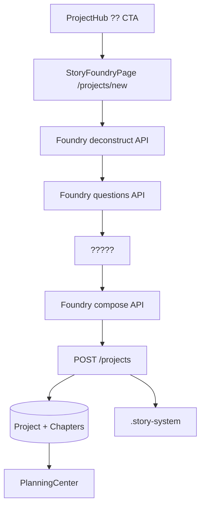

# NovelCraft Phase 8 ????

> **STATUS**: IN_PROGRESS  
> **??**?Phase 8 ? Story Foundry ?????  
> **????**?2026-05-29  
> **PM ??**?Codex  
> **???**?Claude Code????????? Plan Mode ??????????? PM ?????

---

## 0. ??????????

1. ????`docs/briefs/PHASE8_EXECUTION_BRIEF.md`
2. `docs/handoffs/PHASE7_HANDOFF.md` ? ????????????? Phase 0-7 ??
3. `.claude-instructions.md` ? ??????
4. `docs/TESTING.md` ? ???????????
5. `docs/handoffs/HANDOFF_TEMPLATE.md` ? ?? Phase 8 ????????????
6. ?????????????`apps/api/app/agents/deconstruct.py`?`apps/api/app/agents/architect.py`?`apps/web/src/pages/DeconstructPage.tsx`?`apps/web/src/pages/ProjectHub.tsx`?`apps/web/src/lib/api.ts`

---

## 1. Claude Code ??????

Claude Code ?????????????????

1. ????????????????????? handoff?
2. ??????????? Track ???????????????
3. ?????????????? PM ???
4. ???????????? git commit??? commit message ?? why?
5. ???????? handoff?????????????

?????????? StoryGraph Memory / ???? / Continuity Gate???? Phase 9+ ?????????????????? Foundry ????

---

## 2. ?????

Phase 8 ?????????????????????????????????????? **Story Foundry ?????**?

```text
??????
  ? AI ????? / Story Foundry
    1. ?????
    2. AI ???????????
    3. ????????????????????????????
    4. AI ??????
    5. ?????????????????
    6. ??????
```

????????????

- ????????????????????
- ????????????????????????
- ??????????????????????????
- ????????????????????????????????

---

## 3. ?????????????

- [ ] ?? Story Foundry ??????? ? ??? ? ??? compose?
- [ ] ???????? `/projects/new`????????????
- [ ] ProjectHub ??????AI ?????????????????
- [ ] ???????????????? premise?master_setting?synopsis??????
- [ ] ????????? `.story-system/MASTER_SETTING.json`?`volumes/volume_001.json`?`chapters/chapter_XXX.json`?
- [ ] ???????????? Foundry API??????????????
- [ ] ??????? `docs/handoffs/PHASE8_HANDOFF.md`??? `CLAUDE.md` ????? Phase 9??? `docs/PROGRESS.md`?

---

## 4. ????????Claude Code ???

### 4.1 ??????



### 4.2 ????????

???????

- `DeconstructAgent`???????????????????????
- `ArchitectAgent`??? synopsis / chapter outline ???????????? compose ??????????
- `ProjectHub`??????????????????
- `createProject`?????????????????????????
- `StorySystem`??? `save_master_setting`?`save_volume_contract`?`save_chapter_contract`?

### 4.3 Foundry Agents ??

??????????????

- `FoundryQuestionAgent`
  - ??????? + ???????
  - ???6-9 ?????
  - ?? 2-4 ????
  - ???????????????????????????????????????????????????

- `FoundryComposerAgent`
  - ??????? + ?????
  - ???`premise`?`master_setting`?`synopsis`?`first_volume_chapters`?
  - ???? 30-50 ???? target_chapters ????? 50 ????
  - ????? JSON??????? deterministic fallback?

???LLM ?????????????? fallback questions ? fallback compose???????????

### 4.4 Foundry API ??

??????? `apps/api/app/routers/agents.py`??? `/api/v1/agents/foundry/*` ???

#### POST `/api/v1/agents/foundry/deconstruct`

Request:

```json
{
  "book_title": "????",
  "sample_chapters": ["??1", "??2"]
}
```

Response:

```json
{
  "status": "done",
  "deconstruction": {
    "golden_chapters": [],
    "hooks": [],
    "character_patterns": [],
    "world_patterns": [],
    "pacing": [],
    "transferable_patterns": [],
    "red_flags": []
  },
  "fallback": false
}
```

#### POST `/api/v1/agents/foundry/questions`

Request:

```json
{
  "deconstruction": {},
  "preferences": {}
}
```

Response:

```json
{
  "question_sets": [
    {
      "id": "protagonist_core",
      "title": "???????",
      "description": "???????????????",
      "options": [
        {
          "id": "revenge_growth",
          "label": "?????",
          "description": "???????????????????",
          "effects": {
            "protagonist": {},
            "plot_bias": {},
            "pacing": {}
          }
        }
      ]
    }
  ],
  "fallback": false
}
```

#### POST `/api/v1/agents/foundry/compose`

Request:

```json
{
  "book_title": "????",
  "deconstruction": {},
  "selections": {
    "protagonist_core": "revenge_growth"
  },
  "custom_notes": "????"
}
```

Response:

```json
{
  "premise": {},
  "master_setting": {},
  "synopsis": {
    "title": "??",
    "genre": "??",
    "hook": "????",
    "synopsis": "????",
    "volumes": []
  },
  "first_volume_chapters": [
    {
      "chapter_num": 1,
      "title": "?1???",
      "outline": "??",
      "must_cover_nodes": [],
      "forbidden_zones": [],
      "key_characters": [],
      "target_words": 3000
    }
  ],
  "fallback": false
}
```

### 4.5 ????????

???? `POST /api/v1/projects` request body??????

```json
{
  "premise": {},
  "master_setting": {},
  "synopsis": {},
  "chapter_outlines": []
}
```

??????

- `premise` ?? `projects.premise_json`?
- `synopsis` ?? `projects.synopsis_json`?
- `master_setting` ?? `.story-system/MASTER_SETTING.json`?
- `synopsis.volumes[0]` ?? `.story-system/volumes/volume_001.json`?
- `chapter_outlines` ????? DB chapters??? `.story-system/chapters/chapter_XXX.json`?
- ?????? `must_cover_nodes`?`forbidden_zones` ????? story-system chapter contract?

???? Phase 8 ?????????SQLite ??????? schema sync ????????

### 4.6 ?? StoryFoundryPage ??

???? `/projects/new`???????

```ts
type FoundryStep =
  | "input"
  | "deconstructing"
  | "deconstruction"
  | "questions"
  | "composing"
  | "preview"
  | "creating"
  | "done"
  | "error";
```

?????

1. ?????? + 1-3 ????
2. ???????
3. ????????????
4. ????????
5. ????????????????
6. ????????
7. ????????????????????????????????
8. ???????
9. ?? `/projects/{project.id}/planning`?

UI ???

- ?????????????????????
- ????????????????????
- ????? fallback badge?? LLM ??????????????????????????????
- ???????????????

### 4.7 ProjectHub ????

- ? CTA ???AI ???????
- ?? `/projects/new`?
- ??????
  - ?????????
  - ?????????
  - ??????
- ?????????????????????

---

## 5. Track ??

### Track 1?Foundry ????

| ID | ?? | ?? | ???? |
|----|------|------|----------|
| P8-BE01 | Foundry request/response schema | agents router ??? schema | ?????????? |
| P8-BE02 | Deconstruct API | ?? DeconstructAgent | ??? normalized deconstruction |
| P8-BE03 | Questions API | FoundryQuestionAgent | ?? 6 ??????? 2-4 ? |
| P8-BE04 | Compose API | FoundryComposerAgent | ?? premise/master_setting/synopsis/???? |
| P8-BE05 | fallback | agents fallback | ? LLM ? JSON ????????? |
| P8-BE06 | pytest | foundry tests | mock LLM??? |

### Track 2?????? StorySystem ??

| ID | ?? | ?? | ???? |
|----|------|------|----------|
| P8-PRJ01 | ?? ProjectCreate | shared schemas + backend schema | ?? premise/master_setting/synopsis/chapter_outlines |
| P8-PRJ02 | DB ??? | projects / chapters | premise_json?synopsis_json?chapter outline ?? |
| P8-PRJ03 | StorySystem ?? | .story-system | MASTER_SETTING?volume_001?chapter_001+ ?? |
| P8-PRJ04 | round-trip test | pytest | create ??? DB + story-system ?? |

### Track 3?StoryFoundryPage ??

| ID | ?? | ?? | ???? |
|----|------|------|----------|
| P8-FE01 | API client | `apps/web/src/lib/api.ts` | foundryDeconstruct / foundryQuestions / foundryCompose |
| P8-FE02 | ???? | `/projects/new` | ?????? |
| P8-FE03 | ????? | StoryFoundryPage | ??????????? |
| P8-FE04 | ??? | StoryFoundryPage | ?????????? |
| P8-FE05 | ????? | StoryFoundryPage | ????????????? |
| P8-FE06 | ????? | StoryFoundryPage | ???????? |
| P8-FE07 | Vitest | StoryFoundryPage.test.tsx | ?????? |

### Track 4?ProjectHub ??????

| ID | ?? | ?? | ???? |
|----|------|------|----------|
| P8-HUB01 | ? CTA | ProjectHub | ???? AI ????? |
| P8-HUB02 | ????? | ProjectHub | chat/wizard/deconstruct ???? |
| P8-HUB03 | ???? | ProjectHub.test.tsx | ??????? |

### Track 5?????????

| ID | ?? | ?? | ???? |
|----|------|------|----------|
| P8-TEST01 | ???? | pytest | foundry + project create ?? |
| P8-TEST02 | ???? | vitest | foundry page + hub ?? |
| P8-TEST03 | ???? | pnpm typecheck | 0 TS error |
| P8-TEST04 | ???? | pnpm test | ??????????? |
| P8-HANDOFF | ???? | PHASE8_HANDOFF.md | ??????? |

---

## 6. ????

| ID | ??? | ?? |
|----|--------|------|
| P8-A01 | ?????? | ??? CTA ?? `/projects/new` |
| P8-A02 | ???? | ?????? + ???????????? |
| P8-A03 | ????? | ?? 6 ?????????? |
| P8-A04 | ????? | ??? premise/master_setting/synopsis/???? |
| P8-A05 | ???? | ???????????????? |
| P8-A06 | DB ?? | premise_json?synopsis_json?chapters.outline ?? |
| P8-A07 | StorySystem ?? | MASTER_SETTING?volume_001?chapter_001 ?? |
| P8-A08 | ????? | ?????????????????? |
| P8-A09 | fallback | LLM ?????????????????? |
| P8-A10 | ?? | ?? pytest/vitest ??????? pnpm test ?? |

---

## 7. ????

Phase 8 ???????

- ?? StoryEvent / EntityState / ChapterBridge ?????
- ?? StoryGraph Memory ?????
- ?? embedding / vector memory?
- ?? Continuity Gate?
- ??? WriterAgent / Pipeline ??????
- ???? InitChat / DeepInitWizard / DeconstructPage?
- ???? UI ????? Ant Design?

???? Phase 9+?

---

## 8. ???????

- [ ] ????? `STATUS: DONE`
- [ ] `docs/handoffs/PHASE8_HANDOFF.md`
- [ ] `CLAUDE.md` ??????? Phase 9???? Phase 9 ?? `PHASE9_EXECUTION_BRIEF.md` + `PHASE8_HANDOFF.md`
- [ ] `docs/PROGRESS.md` ?? Phase 8 ??
- [ ] ??/??????
- [ ] ???? commit ?? handoff ??
- [ ] ???????????????handoff ??????????????

---

## 9. Phase 9 ??????????

Phase 9 ??? StoryGraph Memory ?????StoryEvent?EntityState?ChapterBridge?StoryMemoryDoc?commit projection?Phase 8 ??????????? Foundry ????? master_setting / synopsis / chapter_outlines ?? Phase 9 ???????
