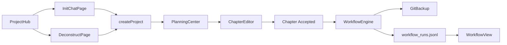

# Phase 6 交接文档

> **阶段**：Phase 6 — 开书到章节交付闭环
> **状态**：DONE
> **完成日期**：2026-05-27
> **最后提交**：（待 git commit）
> **执行者**：Claude Code + Cursor

---

## 1. 本阶段目标回顾

- **Track 0 信任修复**：中文 zip 导出、`.story-system` 打包、WorkflowEngine 单例与 handler 注册
- **Track 1 InitChat 产品化**：对话开书 SSE UI、创意方案选择、ProjectHub 入口
- **Track 2 Deconstruct 产品化**：参考书样章拆解、模式预览、差异化确认创建项目
- **Track 3 备份与迁移**：GitBackup 加固、备份/历史 API、round-trip 测试
- **Track 4 Workflow 闭环**：规则启停、执行历史 UI、备份状态展示
- **Track 5 测试补齐**：InitChat / Deconstruct / WorkflowView / PluginManager / ProjectHub 单测

---

## 2. 交付物清单

| 类别 | 路径/模块 | 说明 | 状态 |
|------|-----------|------|------|
| Track 0 | `apps/api/tests/test_track0_trust.py` | 导出/Story System/Workflow/round-trip 9 用例 | DONE |
| 前端 Page | `apps/web/src/pages/InitChatPage.tsx` | 对话开书 + 方案选择 + 创建项目 | DONE |
| 前端 Page | `apps/web/src/pages/DeconstructPage.tsx` | 拆书输入 + SSE 预览 + 确认创建 | DONE |
| 前端 Page | `apps/web/src/pages/WorkflowView.tsx` | 规则启停 + 备份状态 + 执行历史 | DONE |
| 前端 Component | `apps/web/src/components/ui/switch.tsx` | Base UI Switch（WorkflowView 启停） | DONE |
| 前端 API | `apps/web/src/lib/api.ts` | initChat/deconstruct SSE、toggleWorkflowRule、backup/history | DONE |
| 后端 Workflow | `apps/api/app/workflows/__init__.py` | GitBackup 加固 + workflow_runs.jsonl 持久化 | DONE |
| 后端 API | `apps/api/app/routers/projects.py` | GET backup-status / workflow-history | DONE |
| 路由 | `apps/web/src/App.tsx` | `/projects/new/chat`、`/projects/new/deconstruct` | DONE |
| Hub 入口 | `apps/web/src/pages/ProjectHub.tsx` | 对话开书 / 静态向导 / 拆书 / zip 导入 | DONE |
| 测试 | `InitChatPage.test.tsx` (7) | SSE 对话、方案、错误态 | DONE |
| 测试 | `DeconstructPage.test.tsx` (5) | 拆解预览、错误态 | DONE |
| 测试 | `WorkflowView.test.tsx` (4) | 规则、备份、历史 | DONE |
| 测试 | `PluginManager.test.tsx` (3) | 列表、toggle、rescan | DONE |
| 测试 | `ProjectHub.test.tsx` (3) | 导入 UI + 开书入口 | DONE |
| 文档 | `docs/briefs/PHASE6_EXECUTION_BRIEF.md` | STATUS=DONE | DONE |

---

## 3. 架构变更摘要

### 新增 API 端点

| 前缀 | 端点 | 方法 | 说明 |
|------|------|------|------|
| `/api/v1/projects` | `/{id}/backup-status` | GET | Git 备份最近状态 |
| `/api/v1/projects` | `/{id}/workflow-history` | GET | 工作流执行历史（jsonl） |
| `/api/v1/plugins` | `/workflows/{name}/toggle` | POST | 规则启停（Phase 5 已有，Phase 6 前端接线） |

### 工作流执行历史

章节 `accepted` 后 GitBackup 将记录写入 `{root_dir}/.novelcraft/workflow_runs.jsonl`（append-only，非阻塞）。

### 前端路由

```
/projects/new/chat        → InitChatPage（对话开书，Hub 默认推荐）
/projects/new/deconstruct → DeconstructPage（参考书拆解）
/projects/new/wizard      → DeepInitWizard（静态快速通道）
/settings/workflows       → WorkflowView（启停 + 备份 + 历史）
```



---

## 4. 验收结果

| ID | 验收项 | 结果 | 备注 |
|----|--------|------|------|
| P6-G01 | Track 0 信任修复 | PASS | 9/9 test_track0_trust |
| P6-G02 | InitChat E2E | PASS（自动化） | 7 Vitest + 后端 SSE 测试；**浏览器待 PM 验收** |
| P6-G03 | Deconstruct E2E | PASS（自动化） | 5 Vitest + deconstruct stream API |
| P6-G04 | 章节 accepted 自动化 | PASS（API） | sim/git_backup handler + jsonl；git commit 需真实项目目录 |
| P6-G05 | GitBackup 可控可见 | PASS | WorkflowView 备份状态 + 规则 Switch |
| P6-G06 | 导出导入可信恢复 | PASS（部分） | 正文 + MASTER_SETTING + 设定集；**DB outline 导入未恢复**（见技术债） |
| P6-G07 | WorkflowView 最小可用 | PASS | 启停 + 历史 + 规则预览（只读 JSON） |
| P6-G08 | 前端测试补齐 | PASS | 新增 10 用例 |
| P6-G09 | `pnpm test` 全绿 | PASS | 171 API + 122 Web = **293 tests** |
| P6-G10 | 交接文档 | PASS | 本文档 |

**未通过项及原因**：无阻塞项。YAML 工作流编辑、1280px 正式复验留 Phase 7/8。

### 非浏览器验收项（自动化证据）

| 项 | 证据 |
|----|------|
| 中文 zip Content-Disposition | `test_export_chinese_title_returns_200` |
| zip 含 `.story-system`、不含 `.novelcraft` | `test_export_includes_story_system` |
| 导出→导入 round-trip | `test_export_import_roundtrip` |
| Workflow singleton / toggle | `test_workflow_engine_singleton`、`test_workflow_api_toggle_endpoint` |
| GitBackup 不抛 500 | handler 返回 skipped/error 状态对象 |

---

## 5. 如何运行与验证

```bash
pnpm dev:api    # localhost:8000
pnpm dev:web    # Vite 代理 /api → 8000
pnpm test       # 293 tests
```

**手动验证步骤（PM 浏览器）**：
1. ProjectHub →「对话开书」→ 完成对话 → 选方案 → 创建项目 → 规划中心可见总纲
2. ProjectHub →「拆书」→ 粘贴样章 → 预览 → 确认创建原创项目
3. 写作台章节 accepted 后 → 设置/工作流 → 选择项目 → 查看备份状态与执行历史
4. 项目导出 zip → 导入 zip → 打开项目确认正文可读

---

## 6. 已知问题与技术债

| 优先级 | 问题 | 影响 | 建议处理阶段 |
|--------|------|------|--------------|
| P2 | zip 导入不恢复 DB 章纲 `outline` 字段 | round-trip 后 outline 为空 | Phase 7 ImportService |
| P2 | 工作流 YAML 在线编辑未做 | 仅只读预览 + 启停 | Phase 8 |
| P3 | 1280px 响应式未系统化复验 InitChat/Deconstruct | 小屏可能挤压 | PM 浏览器验收时记录 |
| P3 | Switch 组件 Vitest 点击不触发 Base UI onCheckedChange | toggle 交互靠 API 测试覆盖 | 可选 user-event 升级 |

---

## 7. 下一阶段（Phase 7）输入

**必读上下文**：
- 本交接文档
- `docs/briefs/PHASE6_EXECUTION_BRIEF.md`（Out of Scope 节）
- `.cursor/plans/产品后续规划_c42d14d8.plan.md`

**Phase 7 首要任务**（待 PM 签发简报）：
1. Prompt 工坊 v1 / ReaderPulseSim（按产品规划优先级）
2. 导入 round-trip 补齐 DB outline / 摘要字段
3. PM 浏览器验收 Issue 闭环

**不要重复做**：
- InitChat / Deconstruct 前后端骨架
- WorkflowEngine / GitBackup handler / jsonl 历史
- Track 0 信任修复与 test_track0_trust

**环境/配置注意事项**：
- API 默认端口 **8000**（`vite.config.ts` proxy 对齐 8000）
- 无 Docker 时 MiroFish 推演 graceful 降级不变

---

## 8. 关键文件索引

```
apps/web/src/pages/InitChatPage.tsx
apps/web/src/pages/DeconstructPage.tsx
apps/web/src/pages/WorkflowView.tsx
apps/web/src/components/ui/switch.tsx
apps/web/src/lib/api.ts
apps/api/app/workflows/__init__.py
apps/api/app/routers/projects.py
apps/api/tests/test_track0_trust.py
apps/web/src/pages/WorkflowView.test.tsx
apps/web/src/pages/PluginManager.test.tsx
docs/briefs/PHASE6_EXECUTION_BRIEF.md
scripts/launch-phase6-claude.ps1
```

---

## 9. Git 提交历史（本阶段）

```
（待最终 commit）Phase 6 收尾：Path 修复、round-trip 加强、Workflow/Plugin 单测、handoff
09e2c61 Phase 6 签发与 Workflow 闭环起步
8c61b25 Track 2 Deconstruct 前端产品化
0ab527e Track 1 InitChat 前端产品化
ef750b2 Track 0 信任修复
```

---

## 10. 变更日志（Changelog）

### Added
- InitChatPage / DeconstructPage 完整 UI 与路由
- WorkflowView 备份状态、执行历史、规则 Switch
- `toggleWorkflowRule` API 客户端
- `GET /projects/{id}/backup-status`、`/workflow-history`
- GitBackup `workflow_runs.jsonl` 持久化
- WorkflowView / PluginManager / ProjectHub 扩展单测

### Changed
- `test_export_import_roundtrip` 加强 zip 内容与导入后断言
- `test_workflow_fire_sim_not_skipped` 适配内置 git_backup 规则

### Fixed
- `workflows/__init__.py` 缺少 `Path` import 导致 5 个 API 测试失败
- WorkflowView 调用不存在的 `toggleWorkflowRule`（已补 api.ts）

### Deferred（留到下阶段）
- 工作流 YAML textarea 编辑
- 1280px InitChat/Deconstruct 正式复验
- zip 导入恢复 DB outline

---

## 11. 测试验收

| 模块/功能 | 测试文件 | 用例数 | 结果 |
|-----------|----------|--------|------|
| Track 0 信任 | test_track0_trust.py | 9 | PASS |
| InitChat UI | InitChatPage.test.tsx | 7 | PASS |
| Deconstruct UI | DeconstructPage.test.tsx | 5 | PASS |
| WorkflowView | WorkflowView.test.tsx | 4 | PASS |
| PluginManager | PluginManager.test.tsx | 3 | PASS |
| ProjectHub | ProjectHub.test.tsx | 3 | PASS |
| API 全量 | apps/api/tests | 171 | PASS |
| Web 全量 | apps/web/src | 122 | PASS |

**`pnpm test` 结果**：**PASS**（293 total）

**未覆盖功能（须 Phase 7 补）**：
- Switch 点击 → toggleWorkflowRule 端到端（Base UI 测试环境限制）
- 真实 git commit E2E（需本地 git + 可写项目目录）
