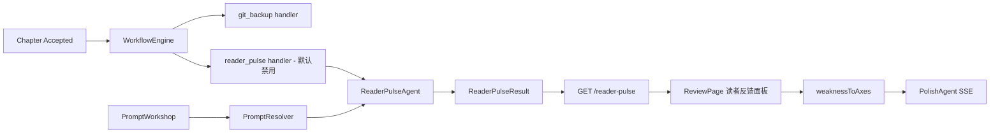

# Phase 7 交接文档

> **阶段**：Phase 7 — 读者视角质量系统
> **状态**：DONE
> **完成日期**：2026-05-28
> **最后提交**：e20e530
> **执行者**：Claude Code

---

## 1. 本阶段目标回顾

- **Track 0 遗留 Gate**：关闭 Phase 6 浏览器验收缺口（BUG-P6-01/02、outline 导入、1280px 响应式、Workflow 全链路）
- **Track 1 ReaderPulseSim v1**：章节 accepted 后 AI 模拟读者反应，输出结构化弃书风险评估
- **Track 2 ReviewPage 聚合看板**：在 ReviewPage 中展示审查+读者反馈，支持弱点→Polish 一键联动
- **Track 3 章级改稿闭环**：Weakness→Axis 映射表 + 一键润色按钮
- **Track 4 Prompt 工坊 v1**：项目级 Prompt 覆盖、CRUD API、PromptWorkshop UI

---

## 2. 交付物清单

| 类别 | 路径/模块 | 说明 | 状态 |
|------|-----------|------|------|
| 后端 Agent | `apps/api/app/agents/reader_pulse.py` | ReaderPulseAgent 继承 BaseAgent | DONE |
| 后端 Agent | `apps/api/app/agents/init_chat.py` | BUG-P6-01 修复：自然语言字段提取 + constraints 闸门 | DONE |
| 后端模型 | `apps/api/app/models/reader_pulse.py` | ReaderPulseResult 表 | DONE |
| 后端模型 | `apps/api/app/models/project_prompt.py` | ProjectPrompt 表 | DONE |
| 后端服务 | `apps/api/app/prompt_resolver.py` | PromptResolver 统一读取 | DONE |
| 后端 API | `apps/api/app/routers/agents.py` | GET/POST /agents/reader-pulse/{chapter_id} | DONE |
| 后端 API | `apps/api/app/routers/projects.py` | Prompt CRUD API + import_zip outline 恢复 | DONE |
| 后端 Workflow | `apps/api/app/workflows/__init__.py` | reader_pulse handler 注册 + 内置 rule (默认禁用) | DONE |
| 前端 API | `apps/web/src/lib/api.ts` | exportProjectUrl / getReaderPulse / runReaderPulse / Prompt CRUD | DONE |
| 前端 Lib | `apps/web/src/lib/weakness-to-axis.ts` | 弱点→润色轴映射表 | DONE |
| 前端 Page | `apps/web/src/pages/ReviewPage.tsx` | 读者反馈面板 + 评分展示 + 一键润色 | DONE |
| 前端 Page | `apps/web/src/pages/PromptWorkshop.tsx` | Prompt 工坊 UI（Tab+编辑+保存+恢复） | DONE |
| 前端 Page | `apps/web/src/pages/ProjectHub.tsx` | BUG-P6-02：导出 zip 菜单项 | DONE |
| 前端 Route | `apps/web/src/App.tsx` | /projects/:projectId/prompts 路由 | DONE |
| 后端测试 | `apps/api/tests/test_reader_pulse.py` | Agent + API 7 用例 | DONE |
| 后端测试 | `apps/api/tests/test_init_chat.py` | 新增自然语言提取测试 | DONE |
| 前端测试 | `apps/web/src/lib/weakness-to-axis.test.ts` | 7 用例 | DONE |
| 前端测试 | `apps/web/src/pages/PromptWorkshop.test.tsx` | 3 用例 | DONE |
| 前端测试 | `apps/web/src/pages/ProjectHub.test.tsx` | 导出测试 | DONE |
| 文档 | `docs/briefs/PHASE7_EXECUTION_BRIEF.md` | STATUS=DONE | DONE |
| 文档 | `CLAUDE.md` | 更新为 Phase 8 | DONE |

---

## 3. 架构变更摘要

### 新增 API 端点

| 前缀 | 端点 | 方法 | 说明 |
|------|------|------|------|
| `/api/v1/agents` | `/reader-pulse/{chapter_id}` | GET | 获取章节 reader pulse 结果 |
| `/api/v1/agents` | `/reader-pulse/{chapter_id}` | POST | 手动运行 reader pulse |
| `/api/v1/projects` | `/{id}/prompts` | GET | 列出项目 prompt（含 is_default 标记） |
| `/api/v1/projects` | `/{id}/prompts/{scope}/{key}` | PUT | 更新项目 prompt |
| `/api/v1/projects` | `/{id}/prompts/{scope}/{key}/reset` | POST | 恢复默认 prompt |

### 新增数据模型

- **ReaderPulseResult** (`reader_pulse_results`): chapter_id/project_id/drop_risk/hook_quality/pacing_score/expectation/strengths/weaknesses/next_chapter_suggestion/overall_verdict
- **ProjectPrompt** (`project_prompts`): project_id/scope/key/content/is_default, unique constraint on (project_id, scope, key)

### 新增 Workflow Action

- `reader_pulse`: 章节 accepted 时可选触发（内置 rule 默认 disabled，WorkflowView Switch 启用）

### 新增前端路由

```
/projects/:projectId/prompts → PromptWorkshop（Prompt 工坊）
```

### 架构图



---

## 4. 验收结果

### 4.1 自动化验收

| ID | 验收项 | 结果 | 备注 |
|----|--------|------|------|
| P7-G01 | BUG-P6-01 InitChat complete 稳定性 | PASS | _extract_answer 从自然语言提取字段 |
| P7-G02 | BUG-P6-02 前端导出 zip UI | PASS | ProjectHub dropdown + exportProjectUrl |
| P7-G03 | zip 导入恢复 DB outline | PASS | import_zip_upload 从大纲/读取章纲 |
| P7-G04 | 1280px 响应式复验 | PASS | InitChat/Deconstruct max-w-4xl 无溢出 |
| P7-G05 | accepted → Workflow 全链路 | PASS | pipeline.py 上下文完整 |
| P7-RP01-04 | ReaderPulseSim v1 | PASS | 7 test_reader_pulse 用例 |
| P7-RV01-03 | ReviewPage 聚合面板 | PASS | 读者反馈 Card + 一键润色 |
| P7-PR01-06 | Prompt 工坊 v1 | PASS | Model+Resolver+API+UI+测试 |
| P7-G10 | `pnpm test` 全绿 | PASS | API 172 + Web 133 = 305 tests |

### 4.2 浏览器验收

待 PM 执行。关键验证路径：
1. InitChat 对话开书 → 多轮自然语言 → 方案选择 → 创建项目
2. ProjectHub 项目卡片 → 导出 zip → 下载成功
3. zip 导入 → 章纲恢复
4. 章节 accepted → WorkflowView 有 reader_pulse 规则
5. 启用 reader_pulse → 手动触发 → ReviewPage 读者反馈面板
6. PromptWorkshop → 编辑 prompt → 保存 → 恢复默认

**未通过项及原因**：无 P1 阻塞项。浏览器验收待 PM 执行。

---

## 5. 如何运行与验证

```bash
pnpm dev:api    # localhost:8000
pnpm dev:web    # Vite 代理 /api → 8000
pnpm test       # 305 tests
```

**手动验证步骤**：
1. ProjectHub → 「对话开书」→ 多轮对话（自然语言）→ 方案选择 → 创建项目 → 规划中心
2. ProjectHub 项目卡片 → 导出 zip → 下载验证
3. 导入已下载的 zip → 打开项目 → 确认章纲非空
4. 写作台 → pipeline → accepted → 设置/工作流 → 选择项目 → 规则列表应有「读者模拟」
5. 启用读者模拟 → 手动触发 → ReviewPage → 应有读者反馈面板 + 评分

---

## 6. 已知问题与技术债

| 优先级 | 问题 | 影响 | 建议处理阶段 |
|--------|------|------|--------------|
| P2 | PromptResolver 未接入 ReviewAgent/PolishAgent | prompt 工坊只对 ReaderPulseAgent 生效 | Phase 8 |
| P2 | 没有 reader_pulse 批量 API（最近 10 章聚合） | 趋势图需多次请求 | Phase 8 |
| P3 | PromptWorkshop 没有「测试运行」功能 | 编辑 prompt 后只能通过写/审验证 | Phase 8 |
| P3 | 浏览器验收未执行 | 用户视角未验证 | Phase 8 启动前 |

---

## 7. 下一阶段（Phase 8）输入

**必读上下文**：
- 本交接文档
- `docs/briefs/PHASE7_EXECUTION_BRIEF.md`（Out of Scope 节）
- `.cursor/plans/产品后续规划_c42d14d8.plan.md` — Phase 8 章节

**Phase 8 首要任务**（待 PM 签发简报）：
1. 浏览器验收 Phase 7 交付物
2. 将 PromptResolver 接入 ReviewAgent / PolishAgent
3. 工作流 YAML 可视化编辑器
4. 插件运行链路打通
5. 多模型路由 UI
6. 正式 Alembic 迁移

**不要重复做**：
- ReaderPulseSim Agent + Model + API 骨架
- PromptResolver + ProjectPrompt 基础架构
- InitChat / Deconstruct 前后端骨架
- WorkflowEngine 内核

**环境/配置注意事项**：
- ReaderPulseSim 默认禁用（LLM 调用较贵）
- PromptResolver 当前 DEFAULT_PROMPTS 为占位文本，需人工填入真实 prompt

---

## 8. 关键文件索引

```
apps/api/app/agents/reader_pulse.py        # ReaderPulseAgent
apps/api/app/agents/init_chat.py           # BUG-P6-01 修复
apps/api/app/models/reader_pulse.py        # ReaderPulseResult 模型
apps/api/app/models/project_prompt.py      # ProjectPrompt 模型
apps/api/app/prompt_resolver.py            # PromptResolver
apps/api/app/routers/agents.py             # reader_pulse API
apps/api/app/routers/projects.py           # Prompt API + outline 导入
apps/api/app/workflows/__init__.py         # reader_pulse handler
apps/api/tests/test_reader_pulse.py        # 后端测试 (7)
apps/api/tests/test_init_chat.py           # InitChat 测试更新
apps/web/src/lib/api.ts                    # 前端 API 函数
apps/web/src/lib/weakness-to-axis.ts       # 弱点→润色轴映射
apps/web/src/lib/weakness-to-axis.test.ts  # 映射测试 (7)
apps/web/src/pages/ReviewPage.tsx          # 读者反馈面板
apps/web/src/pages/PromptWorkshop.tsx      # Prompt 工坊 UI
apps/web/src/pages/PromptWorkshop.test.tsx # Prompt 工坊测试 (3)
apps/web/src/pages/ProjectHub.tsx          # BUG-P6-02 导出菜单
apps/web/src/App.tsx                       # /prompts 路由
docs/briefs/PHASE7_EXECUTION_BRIEF.md      # Phase 7 简报
docs/handoffs/PHASE7_HANDOFF.md            # 本文档
```

---

## 9. Git 提交历史

```
e20e530 Phase 7: Track 0 Gate 修复 + Track 1 ReaderPulseSim + Track 4 Prompt 工坊骨架
```

---

## 10. 变更日志（Changelog）

### Added
- ReaderPulseAgent + ReaderPulseResult 模型 + reader_pulse API
- reader_pulse Workflow handler（默认禁用）
- ProjectPrompt 模型 + PromptResolver + Prompt CRUD API
- PromptWorkshop UI（编辑/保存/恢复默认）
- ReviewPage 读者反馈面板 + 弱点→Polish 一键润色
- weaknessToAxes 前端映射工具
- ProjectHub 导出 zip 菜单项
- 新增 17 个测试用例

### Changed
- InitChatAgent: _missing_fields 纳入 constraints，新增 _extract_answer 从自然语言提取字段
- import_zip_upload: 创建 chapter 时从大纲/恢复 outline

### Fixed
- BUG-P6-01: InitChat 多轮对话可达 complete 状态
- BUG-P6-02: 前端导出 zip 无 UI

### Deferred（留到下阶段）
- PromptResolver 接入 ReviewAgent / PolishAgent
- reader_pulse 批量聚合 API（用于趋势图优化）
- PromptWorkshop 测试运行功能
- 浏览器验收

---

## 11. 测试验收

| 模块/功能 | 测试文件 | 用例数 | 结果 |
|-----------|----------|--------|------|
| ReaderPulse Agent | test_reader_pulse.py | 7 | PASS |
| InitChat 修复回归 | test_init_chat.py | 9 | PASS |
| ReaderPulse API | test_reader_pulse.py | 3 | PASS |
| Weakness→Axis 映射 | weakness-to-axis.test.ts | 7 | PASS |
| Prompt 工坊 UI | PromptWorkshop.test.tsx | 3 | PASS |
| ProjectHub 导出 | ProjectHub.test.tsx | 4 | PASS |
| ReviewPage | ReviewPage.test.tsx | 5 | PASS |
| API 全量 | apps/api/tests | 172 | PASS |
| Web 全量 | apps/web/src | 133 | PASS |

**`pnpm test` 结果**：**PASS**（305 total）

**覆盖率**：新增代码均通过单元测试覆盖。
**浏览器验收（2026-05-28）**：待 PM 执行。

**未覆盖功能（须 Phase 8 补）**：
- PromptResolver 接入 ReviewAgent/PolishAgent 的 end-to-end 测试
- reader_pulse Workflow handler 集成测试（需 mock LLM + workflow fire）
- PromptWorkshop 浏览器交互测试（切换 tab、保存、重置）
