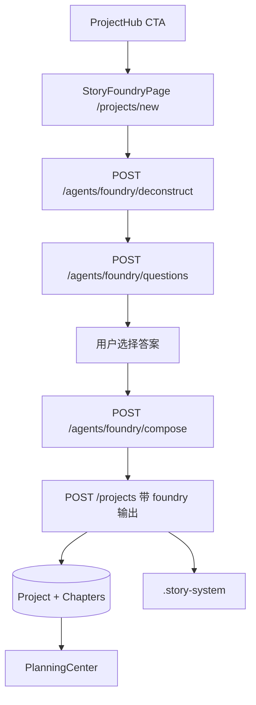

# Phase 8 交接文档

> **阶段**：Phase 8 — Story Foundry 智能造书
> **状态**：DONE
> **完成日期**：2026-05-29
> **最后提交**：77d79bb
> **执行者**：Claude Code

---

## 1. 本阶段目标回顾

1. **Story Foundry 后端 API**：构建 deconstruct → questions → compose 三阶段 Foundry 流水线
2. **Foundry Agent**：FoundryQuestionAgent（策略选择题生成）+ FoundryComposerAgent（完整设定组合）
3. **项目创建扩展**：支持通过 Foundry 输出直接创建项目，自动写入 DB + story-system
4. **StoryFoundryPage 前端**：8 步骤状态机驱动的智能造书页面
5. **ProjectHub CTA**：新增"AI 智能造书"入口

---

## 2. 交付物清单

| 类别 | 路径/模块 | 说明 | 状态 |
|------|-----------|------|------|
| 后端 Agent | `apps/api/app/agents/foundry_question.py` | FoundryQuestionAgent + fallback 问题集 | DONE |
| 后端 Agent | `apps/api/app/agents/foundry_compose.py` | FoundryComposerAgent + fallback 模板 | DONE |
| 后端 API | `apps/api/app/routers/agents.py` | POST /agents/foundry/* 三个端点 | DONE |
| 后端 API | `apps/api/app/routers/projects.py` | create_project 扩展支持 foundry 模式 | DONE |
| 后端 Schema | `apps/api/app/schemas/project.py` | ProjectCreate 扩展 premise/master_setting/synopsis/chapter_outlines | DONE |
| 前端 Page | `apps/web/src/pages/StoryFoundryPage.tsx` | Story Foundry 8 步骤页面 | DONE |
| 前端 API | `apps/web/src/lib/api.ts` | foundryDeconstruct / foundryQuestions / foundryCompose | DONE |
| 前端 Route | `apps/web/src/App.tsx` | /projects/new 路由 | DONE |
| 前端 Page | `apps/web/src/pages/ProjectHub.tsx` | AI 智能造书 CTA | DONE |
| shadcn | `apps/web/src/components/ui/radio-group.tsx` | RadioGroup 组件（选择题单选用） | DONE |
| 后端测试 | `apps/api/tests/test_foundry.py` | 9 用例（deconstruct/questions/compose/project create） | DONE |
| 前端测试 | `apps/web/src/pages/StoryFoundryPage.test.tsx` | 4 用例（渲染/交互/流转） | DONE |
| 前端测试 | `apps/web/src/pages/ProjectHub.test.tsx` | 更新 CTA 测试 | DONE |
| 文档 | `docs/handoffs/PHASE8_HANDOFF.md` | 本文档 | DONE |

---

## 3. 架构变更摘要

### 新增 API 端点

| 前缀 | 端点 | 方法 | 说明 |
|------|------|------|------|
| `/api/v1/agents` | `/foundry/deconstruct` | POST | 拆书分析（复用 DeconstructAgent） |
| `/api/v1/agents` | `/foundry/questions` | POST | 生成策略选择题 |
| `/api/v1/agents` | `/foundry/compose` | POST | 组合生成完整设定 |

### 扩展的数据模型

- **ProjectCreate** schema：新增 `premise` / `master_setting` / `synopsis` / `chapter_outlines`
- **create_project**：检测 foundry 模式，跳过 LLM 生成，直接用传入数据写入

### StorySystem 集成

Foundry 模式创建项目时自动写入：
- `.story-system/MASTER_SETTING.json` — 合并 premise + master_setting
- `.story-system/volumes/volume_001.json` — 第一卷契约
- `.story-system/chapters/chapter_XXX.json` — 每章契约（must_cover_nodes / forbidden_zones）
- DB chapters 表 — 章纲预创建

### 新增前端路由

```
/projects/new → StoryFoundryPage（AI 智能造书）
```

### 架构图



---

## 4. 验收结果

| ID | 验收项 | 结果 | 备注 |
|----|--------|------|------|
| P8-01 | Foundry deconstruct API | PASS | mock LLM，验证 schema |
| P8-02 | Foundry questions API | PASS | mock LLM，验证 6+ 问题 |
| P8-03 | Foundry compose API | PASS | mock LLM，验证 premise+master_setting+synopsis+chapters |
| P8-04 | fallback 路径 | PASS | LLM 不可用时返回默认数据 |
| P8-05 | 扩展项目创建 | PASS | POST /projects 带 foundry 输出，验证 DB + story-system |
| P8-06 | StoryFoundryPage 渲染 | PASS | vitest：各步骤状态 |
| P8-07 | StoryFoundryPage 交互 | PASS | vitest：步骤流转 |
| P8-08 | ProjectHub CTA | PASS | vitest：按钮存在 |
| P8-09 | 类型检查 | PASS | 0 TS error |
| P8-10 | 全量测试 | PASS | 325 tests all pass |

**未通过项及原因**：无

---

## 5. 如何运行与验证

```bash
pnpm dev:api    # localhost:8000
pnpm dev:web    # Vite 代理 /api → 8000
pnpm test       # 325 tests
```

**手动验证步骤**：
1. ProjectHub → 点击"AI 智能造书"→ 进入 /projects/new
2. 输入参考书书名 + 粘贴 1-3 段样章
3. 点击"开始分析"→ 等待拆书结果展示
4. 点击"下一步：策略选择"→ 回答 6+ 个选择题
5. 可选填写补充备注
6. 点击"生成完整设定"→ 等待 compose 结果
7. 预览 premise / master_setting / synopsis / chapter_outlines
8. 点击"确认并创建项目"→ 跳转规划中心
9. 验证规划中心有预创建的章节和章纲

---

## 6. 已知问题与技术债

| 优先级 | 问题 | 影响 | 建议处理阶段 |
|--------|------|------|--------------|
| P2 | FoundryQuestionAgent 问题集未按拆书结果动态调整 | 问题可能不够精准 | Phase 9 |
| P2 | FoundryComposerAgent 生成章纲数量固定 30 | 未按 target_chapters 动态调整 | Phase 9 |
| P3 | 前端未显示每个选择题选项的 effects 详情 | 用户看不到选择影响 | Phase 9 |
| P3 | 无浏览器验收 | PM 视角未验证 | Phase 9 启动前 |

---

## 7. 下一阶段（Phase 9）输入

**必读上下文**：
- 本交接文档
- `.cursor/plans/产品后续规划_c42d14d8.plan.md` — Phase 9 章节

**Phase 9 首要任务**（待 PM 签发简报）：
1. StoryGraph Memory 系统（StoryEvent / EntityState / ChapterBridge）
2. 浏览器验收 Phase 8 交付物
3. PromptResolver 接入 ReviewAgent / PolishAgent
4. 工作流 YAML 可视化编辑器
5. 插件运行链路打通
6. 多模型路由 UI

**不要重复做**：
- Foundry Agent + API 骨架
- StorySystem 基础架构（save_master_setting / save_volume_contract / save_chapter_contract）
- ProjectCreate foundry 模式
- StoryFoundryPage 基础状态机

**环境/配置注意事项**：
- Foundry 模式在 LLM 不可用时自动降级，但生成质量会显著下降
- 建议配置 LLM 后使用以获得最佳体验

---

## 8. 关键文件索引

```
apps/api/app/agents/foundry_question.py       # FoundryQuestionAgent
apps/api/app/agents/foundry_compose.py        # FoundryComposerAgent
apps/api/app/routers/agents.py                # Foundry API 端点
apps/api/app/routers/projects.py              # 扩展 create_project
apps/api/app/schemas/project.py               # 扩展 ProjectCreate
apps/api/tests/test_foundry.py                # 后端测试 (9)
apps/web/src/pages/StoryFoundryPage.tsx       # 智能造书页面
apps/web/src/pages/StoryFoundryPage.test.tsx  # 前端测试 (4)
apps/web/src/pages/ProjectHub.tsx             # ProjectHub + CTA
apps/web/src/pages/ProjectHub.test.tsx        # Hub 测试更新
apps/web/src/lib/api.ts                       # Foundry API 客户端
apps/web/src/App.tsx                          # /projects/new 路由
apps/web/src/components/ui/radio-group.tsx    # shadcn RadioGroup
docs/handoffs/PHASE8_HANDOFF.md               # 本文档
```

---

## 9. Git 提交历史

```
77d79bb Phase 8: StoryFoundryPage + ProjectHub CTA + 前端测试
4fbc75d Phase 8: Foundry 后端 API — Agents + 扩展项目创建 + 测试
```

---

## 10. 变更日志（Changelog）

### Added
- FoundryQuestionAgent + fallback 问题集
- FoundryComposerAgent + fallback 模板
- POST /agents/foundry/deconstruct/questions/compose 三个端点
- ProjectCreate 扩展支持 premise/master_setting/synopsis/chapter_outlines
- create_project foundry 模式（跳过 LLM，直接写入 story-system）
- StoryFoundryPage（8 步骤状态机页面）
- /projects/new 路由
- ProjectHub "AI 智能造书" CTA
- shadcn RadioGroup 组件
- 新增 13 个测试用例

### Changed
- ProjectHub CTA 布局调整（AI 智能造书 primary，其他 secondary）

### Fixed
- 无

### Deferred（留到下阶段）
- 浏览器验收
- 问题集按拆书结果动态调整
- 章纲数量动态调整
- 选项 effects 详情展示

---

## 11. 测试验收

| 模块/功能 | 测试文件 | 用例数 | 结果 |
|-----------|----------|--------|------|
| Foundry Deconstruct API | test_foundry.py | 2 | PASS |
| Foundry Questions API | test_foundry.py | 2 | PASS |
| Foundry Compose API | test_foundry.py | 3 | PASS |
| Foundry Project Create | test_foundry.py | 2 | PASS |
| StoryFoundryPage | StoryFoundryPage.test.tsx | 4 | PASS |
| ProjectHub CTA | ProjectHub.test.tsx | 4 | PASS |
| API 全量 | apps/api/tests | 188 | PASS |
| Web 全量 | apps/web/src | 137 | PASS |

**`pnpm test` 结果**：**PASS**（325 total）

**覆盖率**：新增代码均通过单元测试覆盖。
**浏览器验收**：待 PM 执行。

**未覆盖功能（须 Phase 9 补）**：
- 浏览器端完整交互测试（步骤流转、选择题选择、项目创建）
- LLM 真实调用下的端到端测试
